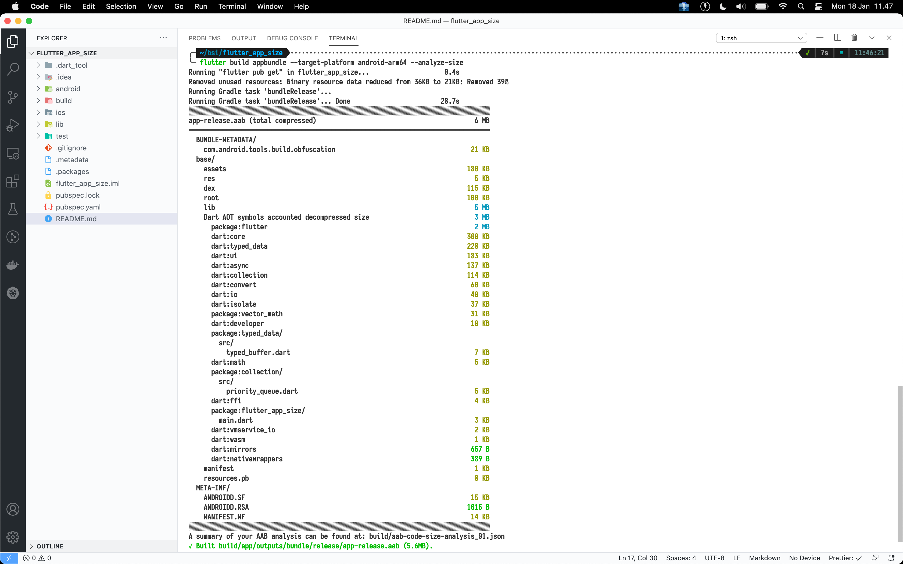
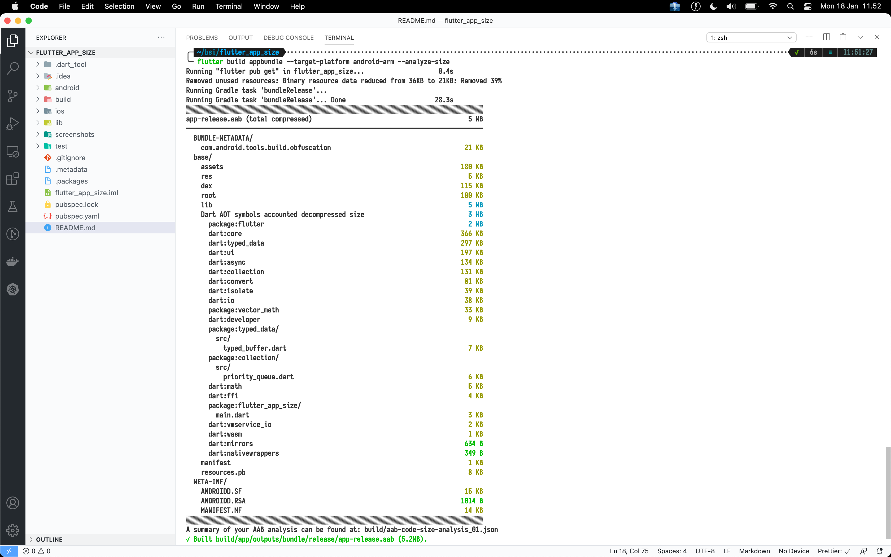
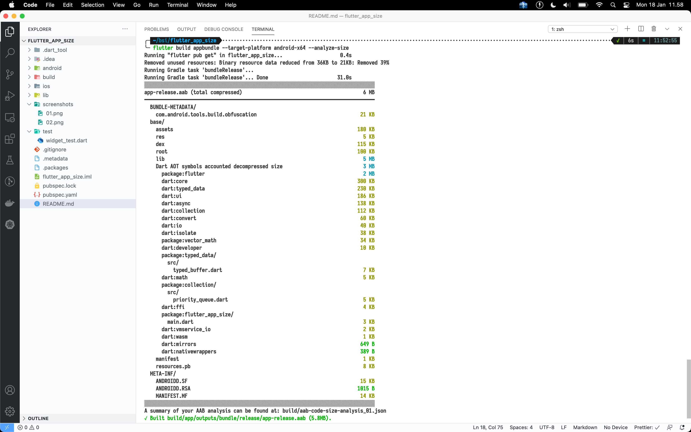
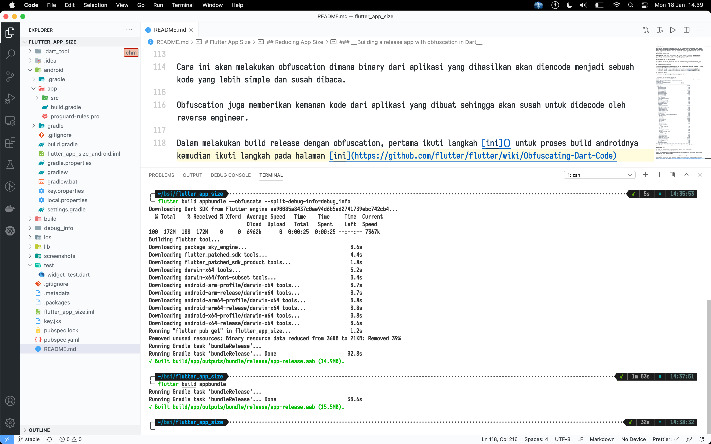

# Flutter App Size

Ukuran aplikasi setelah di build merupakan concern yang umum dirasakan oleh setiap programmer karena semakin besar ukuran aplikasi maka aplikasi akan membutuhkan ruang yang lebih besar, user lebih lama dalam mendownload aplikasi di distribution app seperti Google Play Store dan App Store dan akan menghentikan beberapa fitur dalam proses development seperti Android instant apps. Build aplikasi seperti .apk, .aab dan .ipa merupakan wadah yang menjaga data kode yang dibuat pada aplikasi dan juga aset seperti gambar, icon, font, dsb. 

## Checking the App Total Size 

Secara default perintah `flutter build appbundle` dan `flutter build ios --no-codesign` akan menghasilkan ukuran aplikasi yang akan diupload ke App Store dan Google Play Store, yang sebenarnya bukan ukuran asli aplikasi yang akan diinstal oleh user. Ukuran asli aplikasi yang diinstal disesuaikan dengan arsitektur dari device, seperti di android ada android-arm, android-arm64 dan android-x64.

## Checking Actual App Size per Architecture

Ukuran aplikasi yang ada pada App Store dan Google Play Store bukanlah ukuran asli dari aplikasinya, untuk memastikan ukuran asli dari aplikasi Flutter perlu break down untuk buildnya berdasarkan arsitektur yang digunakan. 

### Break Down the Android App Size

Flutter sekarang mendukung untuk melakukan analisa size apk, untuk melakukan analisa apk berdasarkan arsitektur dari android dapat menggunakan perintah dibawah ini:

1. `flutter build appbundle --target-platform android-arm64 --analyze-size` 
2. `flutter build appbundle --target-platform android-arm --analyze-size` 
3. `flutter build appbundle --target-platform android-x64 --analyze-size` 

### Analyzing iOS App Size

Dalam melakukan analisa ukuran aplikasi iOS dapat menggunakan perintah `flutter build ios --no-codesign --analyze-size` yang akan menghasilkan analisa seperti dibawah ini:

```
# flutter build ios --no-codesign --analyze-size
Running "flutter pub get" in flutter_app_size...                    0.4s
Warning: Building for device with codesigning disabled. You will have to manually codesign before deploying to device.
Building id.refactory.flutterAppSize for device (ios-release)...
Running Xcode build...                                                  
 └─Compiling, linking and signing...                        11.9s
Xcode build done.                                           40.8s
▒▒▒▒▒▒▒▒▒▒▒▒▒▒▒▒▒▒▒▒▒▒▒▒▒▒▒▒▒▒▒▒▒▒▒▒▒▒▒▒▒▒▒▒▒▒▒▒▒▒▒▒▒▒▒▒▒▒▒▒▒▒▒▒▒▒▒▒▒▒▒▒▒▒▒▒▒▒▒▒
━━━━━━━━━━━━━━━━━━━━━━━━━━━━━━━━━━━━━━━━━━━━━━━━━━━━━━━━━━━━━━━━━━━━━━━━━━━━━━━━
  Runner.app                                                              168 MB
  Runner.app/
    AppIcon20x20@2x.png                                                     1 KB
    AppIcon20x20@3x.png                                                     2 KB
    AppIcon29x29.png                                                      1010 B
    AppIcon60x60@2x.png                                                     3 KB
    Runner                                                                170 KB
    AppIcon29x29@2x.png                                                     2 KB
    AppIcon40x40@3x.png                                                     3 KB
    AppIcon29x29~ipad.png                                                 1010 B
    AppIcon40x40@2x.png                                                     2 KB
    AppIcon29x29@3x.png                                                     2 KB
    AppIcon60x60@3x.png                                                     5 KB
    Base.lproj/
      Main.storyboardc                                                      3 KB
      LaunchScreen.storyboardc                                              3 KB
    Assets.car                                                             93 KB
    AppIcon40x40@2x~ipad.png                                                2 KB
    AppIcon76x76@2x~ipad.png                                                4 KB
    AppIcon83.5x83.5@2x~ipad.png                                            4 KB
    AppIcon29x29@2x~ipad.png                                                2 KB
    AppIcon40x40~ipad.png                                                   1 KB
    Frameworks/
      libswiftCoreImage.dylib                                             456 KB
      libswiftObjectiveC.dylib                                            664 KB
      libswiftCore.dylib                                                   91 MB
      libswiftCoreGraphics.dylib                                            2 MB
      libswiftUIKit.dylib                                                   2 MB
      libswiftMetal.dylib                                                 707 KB
      libswiftDispatch.dylib                                                4 MB
      libswiftos.dylib                                                    837 KB
      libswiftCoreFoundation.dylib                                        440 KB
      Flutter.framework                                                    14 MB
      App.framework                                                         9 MB
      Dart AOT symbols accounted decompressed size                          3 MB
        package:flutter                                                     2 MB
        dart:core                                                         300 KB
        dart:typed_data                                                   228 KB
        dart:ui                                                           183 KB
        dart:async                                                        137 KB
        dart:collection                                                   114 KB
        dart:convert                                                       60 KB
        dart:io                                                            40 KB
        dart:isolate                                                       37 KB
        package:vector_math                                                31 KB
        dart:developer                                                     10 KB
        package:typed_data/
          src/
            typed_buffer.dart                                               7 KB
        dart:math                                                           5 KB
        package:collection/
          src/
            priority_queue.dart                                             5 KB
        dart:ffi                                                            4 KB
        package:flutter_app_size/
          main.dart                                                         3 KB
        dart:vmservice_io                                                   2 KB
        dart:wasm                                                           1 KB
        dart:mirrors                                                       657 B
        dart:nativewrappers                                                389 B
      libswiftDarwin.dylib                                                  1 MB
      libswiftQuartzCore.dylib                                            475 KB
      libswiftCoreAudio.dylib                                             816 KB
      libswiftFoundation.dylib                                             41 MB
      libswiftCoreMedia.dylib                                             776 KB
    AppIcon20x20@2x~ipad.png                                                1 KB
    Info.plist                                                              1 KB
    AppIcon76x76~ipad.png                                                   2 KB
▒▒▒▒▒▒▒▒▒▒▒▒▒▒▒▒▒▒▒▒▒▒▒▒▒▒▒▒▒▒▒▒▒▒▒▒▒▒▒▒▒▒▒▒▒▒▒▒▒▒▒▒▒▒▒▒▒▒▒▒▒▒▒▒▒▒▒▒▒▒▒▒▒▒▒▒▒▒▒▒
A summary of your iOS bundle analysis can be found at: build/ios-code-size-analysis_01.json
Built /Users/abdurrohman/bsi/flutter_app_size/build/ios/iphoneos/Runner.app.
```

## Reducing App Size

Ada banyak cara dalam melakukan optimasi ukuran dalam aplikasi Flutter, diantaranya:

### __Building a release app with obfuscation in Dart__

Cara ini akan melakukan obfuscation dimana binary dari aplikasi yang dihasilkan akan diencode menjadi sebuah kode yang lebih simple dan susah dibaca. 

Obfuscation juga memberikan kemanan kode dari aplikasi yang dibuat sehingga akan susah untuk didecode oleh reverse engineer. 

Dalam melakukan build release dengan obfuscation, pertama ikuti langkah [ini](https://flutter.dev/docs/deployment/android#enabling-proguard) untuk proses build androidnya kemudian ikuti langkah pada halaman [ini](https://github.com/flutter/flutter/wiki/Obfuscating-Dart-Code) untuk melakukan Obfuscation pada flutter.

Dan dibawah ini adalah hasilnya:



### __Remove unused Packages__

Untuk memberikan kemudahan dalam prose development aplikasi flutter, biasanya seorang programmer sering memakai packages tambahan seperti dio, http, provider, flutter_bloc, dsb.

Pastikan package yang ditambahkan di pubspec.yaml adalah package yang benar - benar dipakai dan tidak duplikasi dengan package yang lain contoh: provider dan flutter_bloc, ini merupakah hal yang tidak bagus karena memakai package yang berbeda untuk tujuan yang sama.

Semisal ingin mengoptimize ukuran aplikasi secara keseluruhan, maka cara yang paling efektif dengan melakukan fork dari package yang digunakan lalu hapus beberapa kode yang tidak digunakan.

### __Optimize resource files__

Satu hal lagi yang menjadi corcern dalam melakukan optimasi ukuran aplikasi flutter adalah dengan melakukan optimasi resource didalam aplikasi, karena untuk aplikasi yang sudah besar biasanya akan lebih banyak memakan size resource dari assets bukan dari kode. 

Salah satu optimize resource files diantaranya kompress pada file png / jpeg yang akan digunakan, sebisa mungkin untuk memakai asset dengan jenis .svg, memakai font dari dari package Google Fonts bukan insert font file ke dalam project dan melakukan Resource Shrinking dengan menambahkan `shrinkResources true` pada file __android/app/build.gradle__ lebih tepatnya didalam code blok buildTypes.

```groovy
android {
    buildTypes {
        release {
            minifyEnabled true
            useProguard true
            shrinkResources true
            proguardFiles getDefaultProguardFile('proguard-android.txt'), 'proguard-rules.pro'
            signingConfig signingConfigs.release
        }
    }
}
```