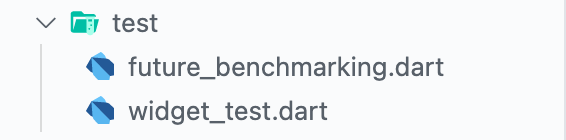
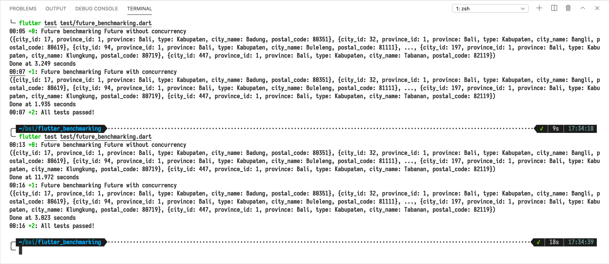
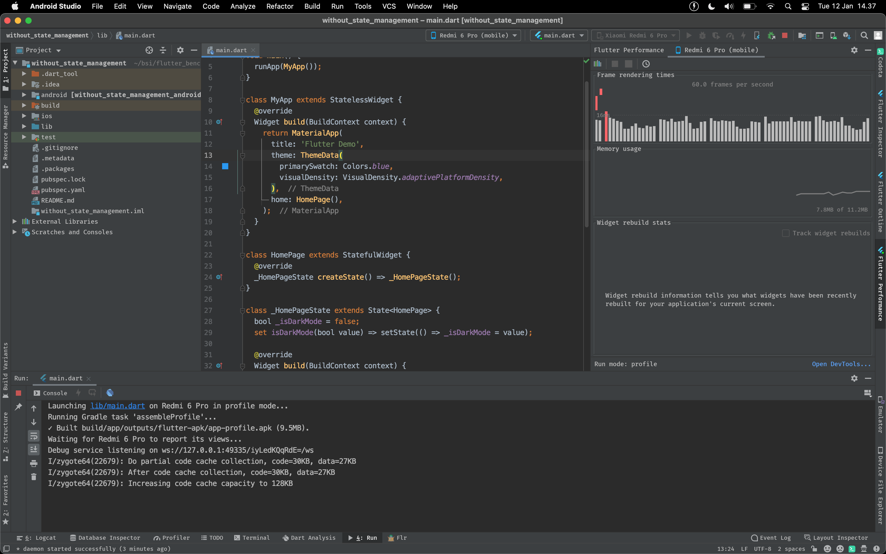
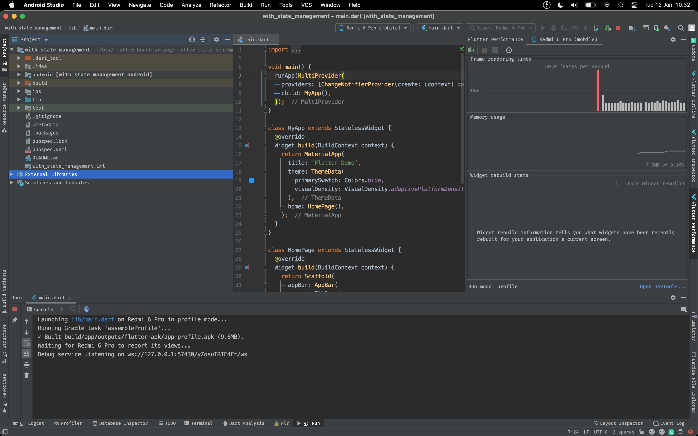
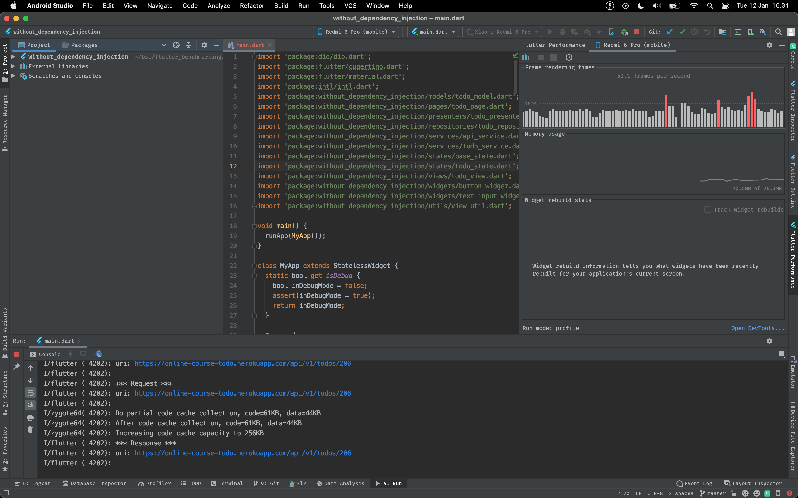
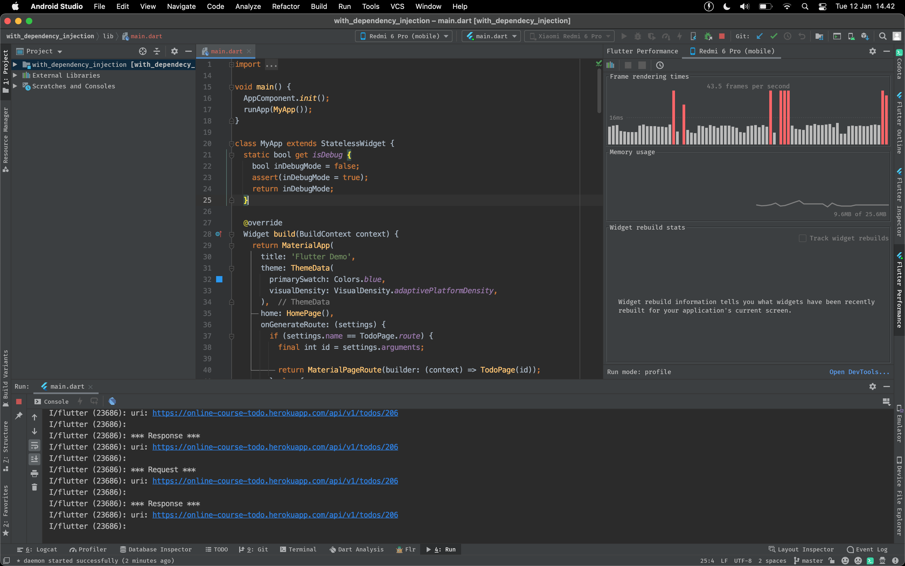
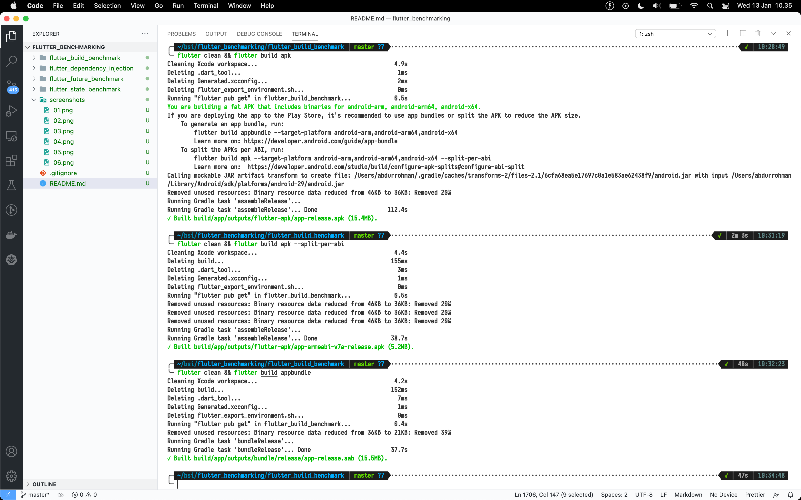

# Flutter Benchmarking

Melakukan perbandingan program atau feature pada flutter, perbandingan akan dilakukan dengan cara unit test, runtime, profiling dan code.

Dalam hal ini ada beberapa kasus yang dapat dilakukan perbandingan, diantaranya:

## Future Benchmarking
Future benchmarking ini dilakukan dengan cara membuat unit test yang akan memanggil API dengan cara Synchronous dan Concurrent. Pada kasus perbandingan ini akan menggunakan [REST API Raja Ongkir](https://rajaongkir.com/dokumentasi/starter) untuk mendapatkan daftar provinsi dan juga daftar kota yang ada di indonesia. Tujuan dari perbandingan ini adalah untuk mengetahui cara yang mana yang lebih cepat dalam menangani pemanggilan REST API secara Synchronous atau Concurrent.

Pada pengujian ini hanya akan memakai package http untuk memanggil REST API dari Raja Ongkir, maka hanya perlu menambahkan package http ke dalam pubspec.yaml.

__pubspec.yaml__
```yaml
dependencies:
  flutter:
    sdk: flutter


  # The following adds the Cupertino Icons font to your application.
  # Use with the CupertinoIcons class for iOS style icons.
  cupertino_icons: ^1.0.0
  http:
```

Kemudian membuat model dari response API yang dihasilkan dari REST API Raja Ongkir, pertama mungkin bisa mulai dengan membuat model dari response province. Hasilnya kurang lebih seperti berikut ini:

__province_model.dart__
```dart
class ProvinceResponse {
  Rajaongkir rajaongkir;

  ProvinceResponse({this.rajaongkir});

  ProvinceResponse.fromJson(Map<String, dynamic> json) {
    rajaongkir = json['rajaongkir'] != null
        ? Rajaongkir.fromJson(json['rajaongkir'])
        : null;
  }

  Map<String, dynamic> toJson() {
    final Map<String, dynamic> data = Map<String, dynamic>();
    if (this.rajaongkir != null) {
      data['rajaongkir'] = this.rajaongkir.toJson();
    }
    return data;
  }
}

class Rajaongkir {
  List<Results> results;

  Rajaongkir({this.results});

  Rajaongkir.fromJson(Map<String, dynamic> json) {
    if (json['results'] != null) {
      results = List<Results>();
      json['results'].forEach((v) {
        results.add(Results.fromJson(v));
      });
    }
  }

  Map<String, dynamic> toJson() {
    final Map<String, dynamic> data = Map<String, dynamic>();
    if (this.results != null) {
      data['results'] = this.results.map((v) => v.toJson()).toList();
    }
    return data;
  }
}

class Query {
  String id;

  Query({this.id});

  Query.fromJson(Map<String, dynamic> json) {
    id = json['id'];
  }

  Map<String, dynamic> toJson() {
    final Map<String, dynamic> data = Map<String, dynamic>();
    data['id'] = this.id;
    return data;
  }
}

class Status {
  int code;
  String description;

  Status({this.code, this.description});

  Status.fromJson(Map<String, dynamic> json) {
    code = json['code'];
    description = json['description'];
  }

  Map<String, dynamic> toJson() {
    final Map<String, dynamic> data = Map<String, dynamic>();
    data['code'] = this.code;
    data['description'] = this.description;
    return data;
  }
}

class Results {
  String provinceId;
  String province;

  Results({this.provinceId, this.province});

  Results.fromJson(Map<String, dynamic> json) {
    provinceId = json['province_id'];
    province = json['province'];
  }

  Map<String, dynamic> toJson() {
    final Map<String, dynamic> data = Map<String, dynamic>();
    data['province_id'] = this.provinceId;
    data['province'] = this.province;
    return data;
  }
}
```

Dilanjutkan dengan membuat model dari response city, kurang lebih hasilnya seperti berikut ini:

__city_model.dart__
```dart
class CityResponse {
  Rajaongkir rajaongkir;

  CityResponse({this.rajaongkir});

  CityResponse.fromJson(Map<String, dynamic> json) {
    rajaongkir = json['rajaongkir'] != null
        ? Rajaongkir.fromJson(json['rajaongkir'])
        : null;
  }

  Map<String, dynamic> toJson() {
    final Map<String, dynamic> data = Map<String, dynamic>();
    if (this.rajaongkir != null) {
      data['rajaongkir'] = this.rajaongkir.toJson();
    }
    return data;
  }
}

class Rajaongkir {
  List<Results> results;

  Rajaongkir({this.results});

  Rajaongkir.fromJson(Map<String, dynamic> json) {
    if (json['results'] != null) {
      results = List<Results>();
      json['results'].forEach((v) {
        results.add(Results.fromJson(v));
      });
    }
  }

  Map<String, dynamic> toJson() {
    final Map<String, dynamic> data = Map<String, dynamic>();
    if (this.results != null) {
      data['results'] = this.results.map((v) => v.toJson()).toList();
    }
    return data;
  }
}

class Query {
  String province;
  String id;

  Query({this.province, this.id});

  Query.fromJson(Map<String, dynamic> json) {
    province = json['province'];
    id = json['id'];
  }

  Map<String, dynamic> toJson() {
    final Map<String, dynamic> data = Map<String, dynamic>();
    data['province'] = this.province;
    data['id'] = this.id;
    return data;
  }
}

class Status {
  int code;
  String description;

  Status({this.code, this.description});

  Status.fromJson(Map<String, dynamic> json) {
    code = json['code'];
    description = json['description'];
  }

  Map<String, dynamic> toJson() {
    final Map<String, dynamic> data = Map<String, dynamic>();
    data['code'] = this.code;
    data['description'] = this.description;
    return data;
  }
}

class Results {
  String cityId;
  String provinceId;
  String province;
  String type;
  String cityName;
  String postalCode;

  Results(
      {this.cityId,
      this.provinceId,
      this.province,
      this.type,
      this.cityName,
      this.postalCode});

  Results.fromJson(Map<String, dynamic> json) {
    cityId = json['city_id'];
    provinceId = json['province_id'];
    province = json['province'];
    type = json['type'];
    cityName = json['city_name'];
    postalCode = json['postal_code'];
  }

  Map<String, dynamic> toJson() {
    final Map<String, dynamic> data = Map<String, dynamic>();
    data['city_id'] = this.cityId;
    data['province_id'] = this.provinceId;
    data['province'] = this.province;
    data['type'] = this.type;
    data['city_name'] = this.cityName;
    data['postal_code'] = this.postalCode;
    return data;
  }
}
```

Untuk permasalahan response dari REST API sudah terselesaikan, selanjutnya membuat file unit test pada folder __test__.



Sekarang membuat function untuk memanggil REST API dengan menggunakan package dari http yang mengembalikkan Future, dengan contoh kode sebagai berikut ini:

```dart
final url = "https://api.rajaongkir.com/starter";
final cityUrl = "$url/city";
final provinceUrl = "$url/province";
final headers = <String, String>{"key": "YOUR_RAJA_ONGKIR_KEY"};

Future<List<ProvinceModel.Results>> getAllProvince() =>
    Http.get(provinceUrl, headers: headers).then((value) {
      final json = jsonDecode(value.body);
      return ProvinceModel.ProvinceResponse.fromJson(json)
          ?.rajaongkir
          ?.results;
    });

Future<List<CityModel.Results>> getAllCity() =>
    Http.get(cityUrl, headers: headers).then((value) {
      final json = jsonDecode(value.body);
      return CityModel.CityResponse.fromJson(json)?.rajaongkir?.results;
    });
```

Untuk melakukan unit test pada flutter, pertama perlu membuat function main yang didalamnya terdapat sebuah function test yang nantinya berisikan unit test yang akan dilakukan, termasuk dengan membandingkan ekspektasi dan realita.

### __Pengujian Future yang tidak menerapkan concurrency__

Pengujian future yang tidak menerapkan concurrency dilakukan dengan membuat dua buah pemanggilan API menggunakan Future dengan cara berurutan, kurang lebih seperti ini untuk contoh kodenya:

```dart
test("Future without concurrency", () async {
  final start = DateTime.now().millisecondsSinceEpoch;
  final provinces = await getAllProvince();

  expect(provinces, isNotNull);

  final firstProvince = provinces.first;
  final cities = await getAllCity();

  expect(firstProvince, isNotNull);
  expect(cities, isNotNull);

  final filteredCitiesById = cities.where((city) => city.provinceId == firstProvince.provinceId);

  expect(filteredCitiesById.length, isNonZero);

  print(filteredCitiesById.map((e) => e.toJson()));

  final end = DateTime.now().millisecondsSinceEpoch;

  print("${(end - start) / 1000} seconds");
});
```

### __Pengujian Future yang menerapkan concurrency__

Pengujian future yang menerapkan concurrency dilakukan dengan membuat sebuah Future wait yang dapat menerikan argument Future lebih dari satu, kurang lebih seperti ini untuk contoh kodenya:

```dart
test("Future with concurrency", () async {
  final start = DateTime.now().millisecondsSinceEpoch;
  final results = await Future.wait([getAllProvince(), getAllCity()]);

  final provinces = results.first as List<ProvinceModel.Results>;
  final cities = results.last as List<CityModel.Results>;

  expect(provinces, isNotNull);
  expect(cities, isNotNull);

  final firstProvince = provinces.first;

  expect(firstProvince, isNotNull);

  final filteredCitiesById = cities.where((city) => city.provinceId == firstProvince.provinceId);

  expect(filteredCitiesById.length, isNonZero);

  print(filteredCitiesById.map((e) => e.toJson()));

  final end = DateTime.now().millisecondsSinceEpoch;

  print("Done at ${(end - start) / 1000} seconds");
});
```

### __Hasil Benchmarking__

Dan hasil dari dua pengujian diatas didapatkan sebuah hasil seperti dibawah ini:



Diketahui bahwa pemanggilan API secara Asynchronouse membutuhkan waktu yang lebih lama daripada pemanggilan API secara Concurent.

## State Benchmarking

State Benchmarking ini dilakukan dengan cara membuat dua buah aplikasi yang dimana aplikasi yang pertama menggunakan ephemeral state (setState), sedangkan aplikasi yang kedua menggunakan state management menggunakan provider. Pada kasus perbandingan ini akan menggunakan sebuah aplikasi simple yang menerapkan state yaitu membuat dark theme pada aplikasi menggunakan state management. Tujuan dari perbandingan ini adalah untuk melihat seberapa banyak waktu yang dibutuhkan dalam frame rendering times pada sebuah aplikasi yang menggunakan ephemeral state management atau app state.

### __Pengujian Aplikasi yang menggunakan Ephemeral State__

Pada aplikasi ini tidak menambahkan package apapun, karena akan menggunakan state management bawaan dari Flutter yaitu setState dari StatefullWidget.

Berikut ini merupakan sebuah contoh kode dalam membuat dark theme menggunakan ephemeral state:

__switch_widget.dart__
```dart
class EphemeralSwitchWidget extends StatelessWidget {
  final Function(bool) callback;
  final bool isDarkMode;

  EphemeralSwitchWidget({this.callback, this.isDarkMode});

  @override
  Widget build(BuildContext context) {
    return Container(
      color: isDarkMode ? Colors.black : Colors.white,
      padding: EdgeInsets.all(8),
      child: Row(
        crossAxisAlignment: CrossAxisAlignment.center,
        children: [
          Expanded(
              child: Text(
            isDarkMode ? "Mode gelap" : "Mode terang",
            style: TextStyle(color: isDarkMode ? Colors.white : Colors.black),
          )),
          CupertinoSwitch(
            value: isDarkMode,
            onChanged: callback,
            activeColor: Colors.white,
            trackColor: Colors.black,
          )
        ],
      ),
    );
  }
}
```

Widget diatas merupakan salah satu widget yang memakai state yang sama dengan state yang ada dibawah ini, sehingga ketika state tersebut berubah maka perlu memanggil setState dari parent agar parentnya ikut berubah tampilan berdasarkan state yang disimpan.

__main.dart__
```dart
void main() {
  runApp(MyApp());
}

class MyApp extends StatelessWidget {
  @override
  Widget build(BuildContext context) {
    return MaterialApp(
      title: 'Flutter Demo',
      theme: ThemeData(
        primarySwatch: Colors.blue,
        visualDensity: VisualDensity.adaptivePlatformDensity,
      ),
      home: HomePage(),
    );
  }
}

class HomePage extends StatefulWidget {
  @override
  _HomePageState createState() => _HomePageState();
}

class _HomePageState extends State<HomePage> {
  bool _isDarkMode = false;
  set isDarkMode(bool value) => setState(() => _isDarkMode = value);

  @override
  Widget build(BuildContext context) {
    return Scaffold(
      appBar: AppBar(
        centerTitle: true,
        title: Text("Ephemeral State"),
      ),
      body: Column(
        crossAxisAlignment: CrossAxisAlignment.center,
        children: [
          EphemeralSwitchWidget(
            callback: (value) => isDarkMode = value,
            isDarkMode: _isDarkMode,
          ),
          Expanded(
              child: Container(
            color: _isDarkMode ? Colors.black : Colors.white,
          ))
        ],
      ),
    );
  }
}
```

Dan dibawah ini merupakan hasil dari pengujian aplikasi dark theme menggunakan ephemeral state:



Aplikasi ini ternyata membutuhkan rata - rata sekitar 14 ms dalam melakukan rendering pada widget, karena dalam menggunakan setState berarti akan melakukan daur ulang build widget secara keseluruhan.

### __Pengujian Aplikasi yang menggunakan App State__

Pada aplikasi ini akan memakai package dari Provider yang dipakai sebagai state management dalam lingkup aplikasi, menambahkan provider pada pubspec.yaml

__pubspec.yaml__
```yaml
name: with_state_management
description: A new Flutter project.
publish_to: 'none'

version: 1.0.0+1

environment:
  sdk: ">=2.7.0 <3.0.0"

dependencies:
  flutter:
    sdk: flutter
    
  cupertino_icons: ^1.0.0
  provider:

dev_dependencies:
  flutter_test:
    sdk: flutter
    
flutter:
  uses-material-design: true
```

Dan berikut ini adalah kode untuk membuat aplikasi dark theme menggunakan state management Provider:

__theme_view_model.dart__

```dart
class ThemeViewModel extends ChangeNotifier {
  bool _isDarkMode = false;
  bool get isDarkMode => _isDarkMode;
  set isDarkMode(bool value) {
    _isDarkMode = value;

    notifyListeners();
  }
}
```

Kode diatas merupakan sebuah class yang mengatur state yang dinamai sebagai ThemeViewModel, dimana ThemeViewModel menjaga state isDarkMode dalam bentuk bool yang nantinya dapat berubah sesuai dengan input dari user. Dalam membuat class Provider perlu meng-extends dari ChangeNotifier dari Provider yang didalamnya ada sebuah method notifyListeners yang digunakan untuk memberitahukan widget bahwa ada perubahan state yang nantinya akan mempengaruhi tampilan dari widget yang menggunakan state tersebut.

__switch_widget.dart__
```dart
class ProviderSwitchWidget extends StatelessWidget {
  @override
  Widget build(BuildContext context) {
    return Consumer<ThemeViewModel>(
        builder: (context, theme, child) => Container(
              color: theme.isDarkMode ? Colors.black : Colors.white,
              padding: EdgeInsets.all(8),
              child: Row(
                crossAxisAlignment: CrossAxisAlignment.center,
                children: [
                  Expanded(
                      child: Text(
                    theme.isDarkMode ? "Mode gelap" : "Mode terang",
                    style: TextStyle(
                        color: theme.isDarkMode ? Colors.white : Colors.black),
                  )),
                  CupertinoSwitch(
                    value: theme.isDarkMode,
                    onChanged: (value) => theme.isDarkMode = value,
                    activeColor: Colors.white,
                    trackColor: Colors.black,
                  )
                ],
              ),
            ));
  }
}
```

Widget diatas merupakan salah satu widget yang memakai Consumer dari Provider yang sudah dibuat secara otomatis widget tersebut akan berubah tampilan berdasarkan state yang disimpan di ThemeViewModel.

__main.dart__
```dart
void main() {
  runApp(MultiProvider(
    providers: [ChangeNotifierProvider(create: (context) => ThemeViewModel())],
    child: MyApp(),
  ));
}

class MyApp extends StatelessWidget {
  @override
  Widget build(BuildContext context) {
    return MaterialApp(
      title: 'Flutter Demo',
      theme: ThemeData(
        primarySwatch: Colors.blue,
        visualDensity: VisualDensity.adaptivePlatformDensity,
      ),
      home: HomePage(),
    );
  }
}

class HomePage extends StatelessWidget {
  @override
  Widget build(BuildContext context) {
    return Scaffold(
      appBar: AppBar(
        centerTitle: true,
        title: Text("App State"),
      ),
      body: Consumer<ThemeViewModel>(
          builder: (context, theme, child) => Column(
                crossAxisAlignment: CrossAxisAlignment.center,
                children: [
                  ProviderSwitchWidget(),
                  Expanded(
                      child: Container(
                    color: theme.isDarkMode ? Colors.black : Colors.white,
                  ))
                ],
              )),
    );
  }
}
```

Perlu diketahui dalam memakai provider, ada beberapa perintah yang perlu dimasukkan lihat pada main function dimana method runApp menerima argument berupa MultiProvider. MultiProvider dipakai untuk mendaftarkan Provider yang dibuat ke dalam lingkup yang lebih besar yaitu aplikasi bukan dalam lingkup page, view atau widget.

Dan dibawah ini merupakan hasil dari pengujian aplikasi dark theme menggunakan app state:



Aplikasi yang menggunakan provider state management memiliki frame render times yang lebih rendah dari ephemeral state, karena provider hanya akan mendaur ulang widget yang memakai state dari provider saja atau Consumer.

## Dependency Injection Benchmarking

Dependency Injection Benchmarking ini dilakukan dengan cara membuat dua buah aplikasi yang dimana aplikasi yang pertama tidak menggunakan dependency injection, sedangkan aplikasi yang kedua menggunakan dependency injection menggunakan injector. 
Depedency Injection dipakai untuk sebuah aplikasi yang memiliki arsitektur yang separation of concern, setiap class memiliki tanggung jawabnya masing - masing dan ini merupakan cara untuk memudahkan dalam maintenance sebuah aplikasi apalagi aplikasi yang sudah memiliki banyak page atau screen.
Pada kasus perbandingan ini akan menggunakan sebuah aplikasi simple yang menerapkan dependency injection yaitu membuat todo app. Tujuan dari perbandingan ini adalah untuk melihat seberapa banyak memory yang dipakai selama menjalankan aplikasi pada aplikasi yang menggunakan dependency injection atau tidak.

Dalam kasus ini aplikasi akan menggunaakan Arsitektur yang simple yaitu MVP dengan tree seperti dibawah ini:

```
lib
├── di
│   ├── app_component.dart
│   └── module
│       ├── network_module.dart
│       ├── presenter_module.dart
│       └── repository_module.dart
├── main.dart
├── models
│   └── todo_model.dart
├── pages
│   ├── home_page.dart
│   └── todo_page.dart
├── presenters
│   └── todo_presenter.dart
├── repositories
│   └── todo_repository.dart
├── services
│   ├── api_service.dart
│   └── todo_service.dart
├── states
│   ├── base_state.dart
│   └── todo_state.dart
├── utils
│   ├── color_util.dart
│   └── view_util.dart
├── views
│   └── todo_view.dart
└── widgets
    ├── button_widget.dart
    └── text_input_widget.dart

11 directories, 19 files
```

Setelah membuat model mungkin bisa berlanjut ke pembuatan api service terlebih dahulu pada folder services.

__api_service.dart__

```dart
enum RequestType { GET, POST, PUT, PATCH, DELETE }

abstract class ApiService {
  Future<Map<String, dynamic>> call(String url, RequestType type,
      {Map<String, String> headers, dynamic body, Map<String, String> params});
}

class ApiServiceImpl extends ApiService {
  final Dio _dio;

  ApiServiceImpl(this._dio);

  @override
  Future<Map<String, dynamic>> call(String url, RequestType type,
      {Map<String, String> headers,
      dynamic body,
      Map<String, String> params}) async {
    Response response;

    try {
      switch (type) {
        case RequestType.GET:
          response = await _dio.get(url,
              queryParameters: params,
              options: Options(
                headers: headers,
              ));
          break;
        case RequestType.POST:
          response = await _dio.post(url,
              data: body,
              queryParameters: params,
              options: Options(
                headers: headers,
              ));
          break;
        case RequestType.PUT:
          response = await _dio.put(url,
              data: body,
              queryParameters: params,
              options: Options(
                headers: headers,
              ));
          break;
        case RequestType.PATCH:
          response = await _dio.patch(url,
              data: body,
              queryParameters: params,
              options: Options(
                headers: headers,
              ));
          break;
        case RequestType.DELETE:
          response = await _dio.delete(url,
              queryParameters: params,
              options: Options(
                headers: headers,
              ));
          break;
        default:
          throw Exception("unsupported request type");
      }
    } catch (e) {
      if (MyApp.isDebug) print(e);
    }

    return response.data;
  }
}
```

Kode diatas digunakan untuk mempermudah dalam memanggil REST API yang sudah disesuaikan dengan methodnya seperti GET, POST, PUT, PATCH dan DELETE. Kemudian dilanjutkan dengan pembuatan todo service.

__todo_service.dart__
```dart
abstract class TodoService {
  Future<Map<String, dynamic>> getAllTodo();
  Future<Map<String, dynamic>> getTodoById(int id);
  Future<Map<String, dynamic>> deleteTodoById(int id);
  Future<Map<String, dynamic>> createTodo(Map<String, dynamic> body);
  Future<Map<String, dynamic>> updateTodoById(
      int id, Map<String, dynamic> body);
}

class TodoServiceImpl implements TodoService {
  final ApiService _service;
  final String _route = "v1/todos";

  TodoServiceImpl(this._service);

  @override
  Future<Map<String, dynamic>> createTodo(Map<String, dynamic> body) {
    return _service.call(_route, RequestType.POST, body: body);
  }

  @override
  Future<Map<String, dynamic>> deleteTodoById(int id) {
    return _service.call("$_route/$id", RequestType.DELETE);
  }

  @override
  Future<Map<String, dynamic>> getAllTodo() {
    return _service.call(_route, RequestType.GET);
  }

  @override
  Future<Map<String, dynamic>> getTodoById(int id) {
    return _service.call("$_route/$id", RequestType.GET);
  }

  @override
  Future<Map<String, dynamic>> updateTodoById(
      int id, Map<String, dynamic> body) {
    return _service.call("$_route/$id", RequestType.PUT, body: body);
  }
}
```

Todo service merupakan service apa saja yang dapat di panggil pada service Todo. Setelah membuat service, selanjutnya membuat repository.

__todo_repository.dart__
```dart
abstract class TodoRepository {
  Future<List<TodoModel>> getAllTodo();
  Future<TodoModel> getTodoById(int id);
  Future<TodoModel> deleteTodoById(int id);
  Future<TodoModel> createTodo(Map<String, dynamic> body);
  Future<TodoModel> updateTodoById(int id, Map<String, dynamic> body);
}

class TodoRepositoryImpl implements TodoRepository {
  final TodoService _service;

  TodoRepositoryImpl(this._service);

  @override
  Future<TodoModel> createTodo(Map<String, dynamic> body) async {
    try {
      final response = await _service.createTodo(body);
      return TodoModel.fromJson(response["data"]);
    } catch (e) {
      if (MyApp.isDebug) print(e);
      return null;
    }
  }

  @override
  Future<TodoModel> deleteTodoById(int id) async {
    try {
      final response = await _service.deleteTodoById(id);
      return TodoModel.fromJson(response["data"]);
    } catch (e) {
      if (MyApp.isDebug) print(e);
      return null;
    }
  }

  @override
  Future<List<TodoModel>> getAllTodo() async {
    try {
      final todos = <TodoModel>[];
      final response = await _service.getAllTodo();

      response["data"]
          ?.forEach((object) => todos.add(TodoModel.fromJson(object)));

      return todos;
    } catch (e) {
      if (MyApp.isDebug) print(e);
      return null;
    }
  }

  @override
  Future<TodoModel> getTodoById(int id) async {
    try {
      final response = await _service.getTodoById(id);
      return TodoModel.fromJson(response["data"]);
    } catch (e) {
      if (MyApp.isDebug) print(e);
      return null;
    }
  }

  @override
  Future<TodoModel> updateTodoById(int id, Map<String, dynamic> body) async {
    try {
      final response = await _service.updateTodoById(id, body);
      return TodoModel.fromJson(response["data"]);
    } catch (e) {
      if (MyApp.isDebug) print(e);
      return null;
    }
  }
}
```

Setelah membuat repository, bisa dilanjutkan untuk membuat state terlebih dahulu.

__base_state.dart__
```dart
abstract class ViewState {}

class Loading extends ViewState {}

class Error extends ViewState {
  final String error;

  Error(this.error);
}

abstract class Success extends ViewState {}
```

Dilanjutkan dengan membuat todo state.

__todo_state.dart__
```dart
class SuccessGetAllTodo extends Success {
  final List<TodoModel> data;
  SuccessGetAllTodo(this.data);
}

class SuccessCreateTodo extends Success {
  final TodoModel data;
  SuccessCreateTodo(this.data);
}

class SuccessGetTodoById extends Success {
  final TodoModel data;
  SuccessGetTodoById(this.data);
}

class SuccessUpdateTodoById extends Success {
  final TodoModel data;
  SuccessUpdateTodoById(this.data);
}

class SuccessDeleteTodoById extends Success {
  final TodoModel data;
  SuccessDeleteTodoById(this.data);
}
```

Setelah membuat state, sekarang bisa membuat view.

__todo_view.dart__
```dart
abstract class TodoView {
  void updateState(ViewState viewState);
}
```

Untuk selanjutnya bisa membuat util untuk mempermudah saja.

__color_util.dart__
```dart
Color colorPrimary = Color(0xff222831);
Color colorSecondary = Color(0xff30475e);
Color colorAccent = Color(0xfff2a365);
Color colorBackground = Color(0xffececec);
Color colorSuccess = Color(0xff158467);
Color colorDanger = Color(0xffc70039);
```

__view_util.dart__
```dart
extension ViewUtil on BuildContext {
  void showSnackbar(String message) {
    Scaffold.of(this).showSnackBar(SnackBar(
      content: Text(
        message,
        style: TextStyle(
            fontSize: 16, color: colorSecondary, fontWeight: FontWeight.w600),
      ),
      backgroundColor: colorBackground,
    ));
  }
}
```

Untuk membuat sebuah Widget yang reusable, mungkin sebaiknya dibuat sebuah class widget tersendiri seperti berikut ini:

__text_input_widget.dart__
```dart
class TextInputWidget extends StatelessWidget {
  final TextEditingController _controller;
  final String _label;

  TextInputWidget(this._label, this._controller);

  @override
  Widget build(BuildContext context) {
    return Container(
      margin: EdgeInsets.all(16),
      child: TextField(
        controller: _controller,
        style: TextStyle(color: colorPrimary, fontSize: 16),
        decoration: InputDecoration(
            contentPadding: EdgeInsets.all(16),
            labelText: _label,
            labelStyle: TextStyle(color: colorPrimary, fontSize: 16),
            enabledBorder: OutlineInputBorder(
                borderSide: BorderSide(
                  color: colorPrimary,
                  width: 2,
                ),
                borderRadius: BorderRadius.circular(8)),
            border: OutlineInputBorder(borderRadius: BorderRadius.circular(8))),
      ),
    );
  }
}
```

__button_widget.dart__

```dart
class ButtonWidget extends StatelessWidget {
  final String text;
  final Function onClick;

  ButtonWidget(this.text, this.onClick);

  @override
  Widget build(BuildContext context) {
    return RaisedButton(
        shape: RoundedRectangleBorder(borderRadius: BorderRadius.circular(8)),
        color: colorSecondary,
        padding: EdgeInsets.all(12),
        child: Text(
          text,
          style: TextStyle(color: Colors.white, fontSize: 16),
        ),
        onPressed: onClick);
  }
}
```

Untuk folder page dan di serta file main.dart akan berbeda untuk setiap pengujian.

### __Pengujian Aplikasi yang tidak menggunakan Dependency Injection__

Dalam membuat aplikasi todo app yang tidak menggunakan dependency injection hanya memerlukan sedikit package tambahan, kurang lebih seperti ini untuk isi dari pubspec.yaml:

__pubspec.yaml__
```yaml
name: without_dependency_injection
description: A new Flutter project.
publish_to: 'none'
version: 1.0.0+1

environment:
  sdk: ">=2.7.0 <3.0.0"

dependencies:
  flutter:
    sdk: flutter

  cupertino_icons: ^1.0.0
  dio:
  intl:

dev_dependencies:
  flutter_test:
    sdk: flutter

flutter:
  uses-material-design: true
```

Berlanjut pada folder page untuk proses pembuatannya.

__todo_page.dart__
```dart
class TodoPage extends StatefulWidget {
  static String route = "/todo_page";

  final int _id;

  TodoPage(this._id);

  @override
  _TodoPageState createState() => _TodoPageState();
}

class _TodoPageState extends State<TodoPage> implements TodoView {
  ViewState _state;
  set state(value) => setState(() => _state = value);
  TodoModel _todo;
  set todo(value) => setState(() => _todo = value);

  TodoPresenter _todoPresenter;

  final _controller = TextEditingController(text: "");
  set text(value) => setState(() => _controller.text = value);

  @override
  void didChangeDependencies() {
    final baseUrl = "https://online-course-todo.herokuapp.com/api/";
    final dio = Dio();

    dio.options.connectTimeout = 60 * 1000;
    dio.options.receiveTimeout = 60 * 1000;
    dio.options.baseUrl = baseUrl;

    dio.interceptors.add(LogInterceptor(
      requestBody: MyApp.isDebug,
      responseBody: MyApp.isDebug,
      requestHeader: MyApp.isDebug,
      responseHeader: MyApp.isDebug,
      request: MyApp.isDebug,
      error: MyApp.isDebug,
    ));

    final ApiService api = ApiServiceImpl(dio);
    final TodoService service = TodoServiceImpl(api);
    final TodoRepository repository = TodoRepositoryImpl(service);
    _todoPresenter = TodoPresenterImpl(repository, this);
    _todoPresenter.getTodoById(widget._id);

    super.didChangeDependencies();
  }

  @override
  Widget build(BuildContext context) {
    return Scaffold(
      appBar: AppBar(
        title: Text("Todo Page with Depedency Injection"),
      ),
      body: (_state is Loading)
          ? Center(
              child: CupertinoActivityIndicator(
                radius: 16,
              ),
            )
          : Column(
              children: [
                SizedBox(
                  height: 16,
                ),
                TextInputWidget("Update todo", _controller),
                CheckboxListTile(
                  value: _todo.status,
                  onChanged: (value) => {setState(() => _todo.status = value)},
                  title: Text("is done?"),
                ),
                Container(
                  width: double.maxFinite,
                  margin: EdgeInsets.all(16),
                  child: ButtonWidget("Submit", () {
                    if (_controller.text.isNotEmpty) {
                      _todo.task = _controller.text;
                      _todoPresenter.updateTodoById(_todo.id, _todo.toJson());
                    } else {
                      context.showSnackbar("Todo can't be empty!");
                    }
                  }),
                ),
              ],
            ),
    );
  }

  @override
  void updateState(ViewState viewState) {
    state = viewState;

    if (viewState is Success) {
      if (viewState is SuccessGetTodoById) {
        todo = viewState.data;
        text = viewState.data.task;
      } else if (viewState is SuccessUpdateTodoById) {
        todo = viewState.data;
        text = viewState.data.task;
      }
    }
  }
}
```

Pada class TodoPage terdapat sebuah class yaitu TodoPresenter yang dimana dalam membuat TodoPresenter perlu ada beberapa class lainnya yang perlu dibuat contohnya dio, service dan repository.

__home_page.dart__

```dart
class HomePage extends StatefulWidget {
  @override
  _HomePageState createState() => _HomePageState();
}

class _HomePageState extends State<HomePage> implements TodoView {
  ViewState _state;
  set state(value) => setState(() => _state = value);
  List<TodoModel> _todos = [];
  set todos(value) => setState(() => _todos = value);
  TodoPresenter _todoPresenter;

  final _controller = TextEditingController(text: "");

  @override
  void didChangeDependencies() {
    final baseUrl = "https://online-course-todo.herokuapp.com/api/";
    final dio = Dio();

    dio.options.connectTimeout = 60 * 1000;
    dio.options.receiveTimeout = 60 * 1000;
    dio.options.baseUrl = baseUrl;

    dio.interceptors.add(LogInterceptor(
      requestBody: MyApp.isDebug,
      responseBody: MyApp.isDebug,
      requestHeader: MyApp.isDebug,
      responseHeader: MyApp.isDebug,
      request: MyApp.isDebug,
      error: MyApp.isDebug,
    ));

    final ApiService api = ApiServiceImpl(dio);
    final TodoService service = TodoServiceImpl(api);
    final TodoRepository repository = TodoRepositoryImpl(service);
    _todoPresenter = TodoPresenterImpl(repository, this);
    _todoPresenter.getAllTodo();

    super.didChangeDependencies();
  }

  @override
  Widget build(BuildContext context) {
    return Scaffold(
      appBar: AppBar(
        title: Text("Flutter with Depedency Injection"),
      ),
      body: (_state is Loading)
          ? Center(
        child: CupertinoActivityIndicator(
          radius: 16,
        ),
      )
          : Builder(
          builder: (context) => Column(
            children: [
              Expanded(
                child: ListView.builder(
                  itemBuilder: (context, index) {
                    final todo = _todos[index];

                    return Row(
                      children: [
                        Checkbox(
                          value: todo.status,
                          onChanged: (value) {
                            _todoPresenter.updateTodoById(
                                todo.id, {"status": value});
                          },
                        ),
                        Expanded(
                          child: ListTile(
                            title: Text(todo.task),
                            subtitle: Text(
                                DateFormat("EEEE, dd MMMM yyyy")
                                    .format(DateTime.parse(todo.date))),
                            onTap: () {
                              Navigator.pushNamed(
                                  context, TodoPage.route,
                                  arguments: todo.id);
                            },
                          ),
                        ),
                        IconButton(
                            padding: EdgeInsets.all(8),
                            icon: Icon(Icons.close),
                            onPressed: () {
                              _todoPresenter.deleteTodoById(todo.id);
                            })
                      ],
                    );
                  },
                  itemCount: _todos.length,
                ),
              ),
              Row(
                crossAxisAlignment: CrossAxisAlignment.center,
                mainAxisAlignment: MainAxisAlignment.center,
                children: [
                  Expanded(
                      child:
                      TextInputWidget("Create todo", _controller)),
                  ButtonWidget("Submit", () {
                    if (_controller.text.isNotEmpty) {
                      _todoPresenter.createTodo({
                        "task": _controller.text,
                      });
                    } else {
                      context.showSnackbar("Todo can't be empty!");
                    }
                  }),
                  SizedBox(
                    width: 16,
                  )
                ],
              )
            ],
          )),
    );
  }

  @override
  void updateState(ViewState viewState) {
    state = viewState;

    if (viewState is Error) {
      context.showSnackbar(viewState.error);
    }

    if (viewState is Success) {
      if (viewState is SuccessGetAllTodo) {
        if (viewState.data != null) todos = viewState.data;
      } else if (viewState is SuccessUpdateTodoById) {
        if (viewState.data != null) {
          setState(() {
            final index = _todos.indexWhere((e) => e.id == viewState.data.id);
            if (index != -1) _todos[index] = viewState.data;
          });
        }
      } else if (viewState is SuccessDeleteTodoById) {
        if (viewState.data != null) {
          setState(() {
            final index = _todos.indexWhere((e) => e.id == viewState.data.id);
            if (index != -1) _todos.removeAt(index);
          });
        }
      } else if (viewState is SuccessCreateTodo) {
        _controller.text = "";

        if (viewState.data != null) {
          setState(() {
            _todos.insert(0, viewState.data);
          });
        }
      }
    }
  }
}
```

Sama seperti dengan class TodoPage yang mempunyai sebuah class TodoPresenter yang dimana dalam membuat TodoPresenter perlu ada beberapa class lainnya yang perlu dibuat contohnya dio, service dan repository yang berbeda dari TodoPage sebelumnya.

__main.dart__
```dart
void main() {
  runApp(MyApp());
}

class MyApp extends StatelessWidget {
  static bool get isDebug {
    bool inDebugMode = false;
    assert(inDebugMode = true);
    return inDebugMode;
  }

  @override
  Widget build(BuildContext context) {
    return MaterialApp(
      title: 'Flutter Demo',
      theme: ThemeData(
        primarySwatch: Colors.blue,
        visualDensity: VisualDensity.adaptivePlatformDensity,
      ),
      home: HomePage(),
      onGenerateRoute: (settings) {
        if (settings.name == TodoPage.route) {
          final int id = settings.arguments;

          return MaterialPageRoute(builder: (context) => TodoPage(id));
        } else {
          throw Exception("Unsupported route name");
        }
      },
    );
  }
}
```

Dan berikut inia dalah hasil dari pengujian aplikasi yang tidak menggunakan Dependency Injection:



Dari hasil diatas diketahui bahwa aplikasi memakai memory yang terus meningkat, hal ini dikarenakan karena pada HomePage dan TodoPage memakai memory yang sama namun berbeda ini bisa terjadi karena data yang tersimpan berbeda maka terdapat duplikasi memory.

### __Pengujian Aplikasi yang menggunakan Dependency Injection__

Dalam membuat aplikasi todo app yang menggunakan dependency injection diperlukan package tambahan yaitu injector yang digunakan untuk depedency injection, kurang lebih seperti ini untuk isi dari pubspec.yaml

__pubspec.yaml__
```yaml
name: with_dependency_injection
description: A new Flutter project.
publish_to: 'none'
version: 1.0.0+1

environment:
  sdk: ">=2.7.0 <3.0.0"

dependencies:
  flutter:
    sdk: flutter

  cupertino_icons: ^1.0.0
  injector:
  dio:
  intl:

dev_dependencies:
  flutter_test:
    sdk: flutter

flutter:
  uses-material-design: true
```

Setelah menambahkan package injector, sekarang fokus pada folder __di__ dimulai dari folder __module__ terlebih dahulu. Folder __module__ digunakan untuk mendaftarkan isntance pada aplikasi flutter yang nantinya hanya panggil saja kelasnya yang sudah didaftarkan.

__network_module.dart__
```dart
class NetworkModule {
  static void init(Injector injector) {
    injector.registerSingleton<Dio>(() {
      final baseUrl = "https://online-course-todo.herokuapp.com/api/";
      final dio = Dio();

      dio.options.connectTimeout = 60 * 1000;
      dio.options.receiveTimeout = 60 * 1000;
      dio.options.baseUrl = baseUrl;

      dio.interceptors.add(LogInterceptor(
        requestBody: MyApp.isDebug,
        responseBody: MyApp.isDebug,
        requestHeader: MyApp.isDebug,
        responseHeader: MyApp.isDebug,
        request: MyApp.isDebug,
        error: MyApp.isDebug,
      ));

      return dio;
    });

    injector.registerSingleton<ApiService>(
        () => ApiServiceImpl(injector.get<Dio>()));

    injector.registerSingleton<TodoService>(
        () => TodoServiceImpl(injector.get<ApiService>()));
  }
}
```

Network module berisikan instance dio dan service yang akan didaftarkan pada aplikasi flutter.

__presenter_module.dart__
```dart
class PresenterModule {
  static void init(Injector injector) {
    injector.registerDependency<TodoPresenterImpl>(
        () => TodoPresenterImpl(injector.get<TodoRepository>()));

    injector.registerDependency<TodoPresenter>(
        () => injector.get<TodoPresenterImpl>());
  }
}
```

Presenter module berisikan instance presenter saja yang akan didaftarkan pada aplikasi flutter.

__repository_module.dart__
```dart
class RepositoryModule {
  static void init(Injector injector) {
    injector.registerSingleton<TodoRepository>(
        () => TodoRepositoryImpl(injector.get<TodoService>()));
  }
}
```

Repository module berisikan instance repository saja yang akan didaftarkan pada aplikasi flutter.

__app_component.dart__
```dart
class AppComponent {
  static void init() {
    NetworkModule.init(injector);
    RepositoryModule.init(injector);
    PresenterModule.init(injector);
  }

  static Injector get injector => Injector.appInstance;
}
```

Setelah mendaftarkan module, sekarang membuat container yang akan dipanggil pada main function. 

Kemudian berlanjut dalam pembuatan class pada folder page dan main.dart, kurang lebih seperti dibawah ini:

__todo_page.dart__
```dart
class TodoPage extends StatefulWidget {
  static String route = "/todo_page";

  final int _id;

  TodoPage(this._id);

  @override
  _TodoPageState createState() =>
      _TodoPageState(AppComponent.injector.get<TodoPresenterImpl>());
}

class _TodoPageState extends State<TodoPage> implements TodoView {
  ViewState _state;
  set state(value) => setState(() => _state = value);
  TodoModel _todo;
  set todo(value) => setState(() => _todo = value);

  TodoPresenter _todoPresenter;

  final _controller = TextEditingController(text: "");
  set text(value) => setState(() => _controller.text = value);

  _TodoPageState(TodoPresenterImpl todoPresenterImpl) {
    todoPresenterImpl.view = this;
    _todoPresenter = todoPresenterImpl;
  }

  @override
  void didChangeDependencies() {
    _todoPresenter.getTodoById(widget._id);

    super.didChangeDependencies();
  }

  @override
  Widget build(BuildContext context) {
    return Scaffold(
      appBar: AppBar(
        title: Text("Todo Page with Depedency Injection"),
      ),
      body: (_state is Loading)
          ? Center(
              child: CupertinoActivityIndicator(
                radius: 16,
              ),
            )
          : Column(
              children: [
                SizedBox(
                  height: 16,
                ),
                TextInputWidget("Update todo", _controller),
                CheckboxListTile(
                  value: _todo.status,
                  onChanged: (value) => {setState(() => _todo.status = value)},
                  title: Text("is done?"),
                ),
                Container(
                  width: double.maxFinite,
                  margin: EdgeInsets.all(16),
                  child: ButtonWidget("Submit", () {
                    if (_controller.text.isNotEmpty) {
                      _todo.task = _controller.text;
                      _todoPresenter.updateTodoById(_todo.id, _todo.toJson());
                    } else {
                      context.showSnackbar("Todo can't be empty!");
                    }
                  }),
                ),
              ],
            ),
    );
  }

  @override
  void updateState(ViewState viewState) {
    state = viewState;

    if (viewState is Success) {
      if (viewState is SuccessGetTodoById) {
        todo = viewState.data;
        text = viewState.data.task;
      } else if (viewState is SuccessUpdateTodoById) {
        todo = viewState.data;
        text = viewState.data.task;
      }
    }
  }
}
```

Pada page ini terdapat sebuah argument presenter yang dimana sudah didaftakan aplikasi menggunakan injector, jadi hanya perlu memanggilnya saja dari injector.

__home_page.dart__
```dart
class HomePage extends StatefulWidget {
  @override
  _HomePageState createState() =>
      _HomePageState(AppComponent.injector.get<TodoPresenterImpl>());
}

class _HomePageState extends State<HomePage> implements TodoView {
  ViewState _state;
  set state(value) => setState(() => _state = value);
  List<TodoModel> _todos = [];
  set todos(value) => setState(() => _todos = value);
  TodoPresenter _todoPresenter;

  _HomePageState(TodoPresenterImpl todoPresenterImpl) {
    todoPresenterImpl.view = this;
    _todoPresenter = todoPresenterImpl;
  }

  final _controller = TextEditingController(text: "");

  @override
  void didChangeDependencies() {
    _todoPresenter.getAllTodo();

    super.didChangeDependencies();
  }

  @override
  Widget build(BuildContext context) {
    return Scaffold(
      appBar: AppBar(
        title: Text("Flutter with Depedency Injection"),
      ),
      body: (_state is Loading)
          ? Center(
              child: CupertinoActivityIndicator(
                radius: 16,
              ),
            )
          : Builder(
              builder: (context) => Column(
                    children: [
                      Expanded(
                        child: ListView.builder(
                          itemBuilder: (context, index) {
                            final todo = _todos[index];

                            return Row(
                              children: [
                                Checkbox(
                                  value: todo.status,
                                  onChanged: (value) {
                                    _todoPresenter.updateTodoById(
                                        todo.id, {"status": value});
                                  },
                                ),
                                Expanded(
                                  child: ListTile(
                                    title: Text(todo.task),
                                    subtitle: Text(
                                        DateFormat("EEEE, dd MMMM yyyy")
                                            .format(DateTime.parse(todo.date))),
                                    onTap: () {
                                      Navigator.pushNamed(
                                          context, TodoPage.route,
                                          arguments: todo.id);
                                    },
                                  ),
                                ),
                                IconButton(
                                    padding: EdgeInsets.all(8),
                                    icon: Icon(Icons.close),
                                    onPressed: () {
                                      _todoPresenter.deleteTodoById(todo.id);
                                    })
                              ],
                            );
                          },
                          itemCount: _todos.length,
                        ),
                      ),
                      Row(
                        crossAxisAlignment: CrossAxisAlignment.center,
                        mainAxisAlignment: MainAxisAlignment.center,
                        children: [
                          Expanded(
                              child:
                                  TextInputWidget("Create todo", _controller)),
                          ButtonWidget("Submit", () {
                            if (_controller.text.isNotEmpty) {
                              _todoPresenter.createTodo({
                                "task": _controller.text,
                              });
                            } else {
                              context.showSnackbar("Todo can't be empty!");
                            }
                          }),
                          SizedBox(
                            width: 16,
                          )
                        ],
                      )
                    ],
                  )),
    );
  }

  @override
  void updateState(ViewState viewState) {
    state = viewState;

    if (viewState is Error) {
      context.showSnackbar(viewState.error);
    }

    if (viewState is Success) {
      if (viewState is SuccessGetAllTodo) {
        if (viewState.data != null) todos = viewState.data;
      } else if (viewState is SuccessUpdateTodoById) {
        if (viewState.data != null) {
          setState(() {
            final index = _todos.indexWhere((e) => e.id == viewState.data.id);
            if (index != -1) _todos[index] = viewState.data;
          });
        }
      } else if (viewState is SuccessDeleteTodoById) {
        if (viewState.data != null) {
          setState(() {
            final index = _todos.indexWhere((e) => e.id == viewState.data.id);
            if (index != -1) _todos.removeAt(index);
          });
        }
      } else if (viewState is SuccessCreateTodo) {
        _controller.text = "";

        if (viewState.data != null) {
          setState(() {
            _todos.insert(0, viewState.data);
          });
        }
      }
    }
  }
}
```

Pada page ini terdapat sebuah class presenter yang dimana sudah didaftakan aplikasi menggunakan injector, jadi hanya perlu memanggilnya saja dari injector.

Dan berikut ini hasil dari pengujian aplikasi yang menggunakan dependency injection:



Terlihat dari gambar diatas bahwa aplikasi yang menggunakan depedency injection memakai memori yang lebih sedikit dikarenakan tidak adanya duplikasi memory untuk instance yang sama.

## Build Benchmarking

Build Benchmarking ini dilakukan dengan cara membuat satu buah aplikasi yang dimana aplikasi akan dibuild, kemudian akan dilakukan perbandingan size appnya, setiap akan melakukan build ada perintah flutter clean terlebih dahulu dengan harapan tidak akan menambahkan size untuk proses build berikutnya. Pada kasus perbandingan ini akan menggunakan sebuah aplikasi simple yang sudah menjadi template dari flutter yaitu counter app. Tujuan dari perbandingan ini adalah untuk melihat seberapa banyak size yang dihasilkan dari build dengan cara build apk, build apk split by abi dan app bundle.

### __Pengujian App Size dengan cara build APK__

Pengujian pertama ini hanya akan melakukan proses build apk dengan perintah `flutter clean && flutter build apk`.

### __Pengujain App Size dengan cara build APK split by abi__

Pengujian kedua ini hanya akan melakukan proses build dengan cara build apk split by abi dengan perintah `flutter clean && flutter build apk --split-per-abi`

### __Pengujain App Size dengan cara build app bundle__

Pengujian kedua ini hanya akan melakukan proses build dengan cara build apk split by abi dengan perintah `flutter clean && flutter build appbundle`

### __Hasil Benchmarking__

Berikut ini adalah hasil dari build apk dengan tiga cara diatas:



Perlu diketahui, dikarenakan kasus ini hanya menggunakan aplikasi template dari flutter akan ada beberapa hal yang masih bisa dipertimbangakan lagi.

Hasil diatas membuktikan bahwa build apk dengan cara split by abi menghasilkan size yang lebih kecil dibandingkan dengan build yang lainnya, tapi perlu diketahui untuk upload di Google Play Store lebih disarankan memakai appbundle. 

Ada beberapa pertimbangan untuk memakai build apk split by abi atau appbundle (hindari deployment dengan build apk). Pertama appbundle tidak dapat diinstal diluar Google Play Store jadi tidak cocok untuk distribusi apk ke tim QA untuk testing, namun build apk split by abi bisa diinstal di luar Google Play Store dengan catatan disesuaikan dengan arsitektur dari real devicenya apakah android-arm atau android-arm64 atau bahkan android-x64.