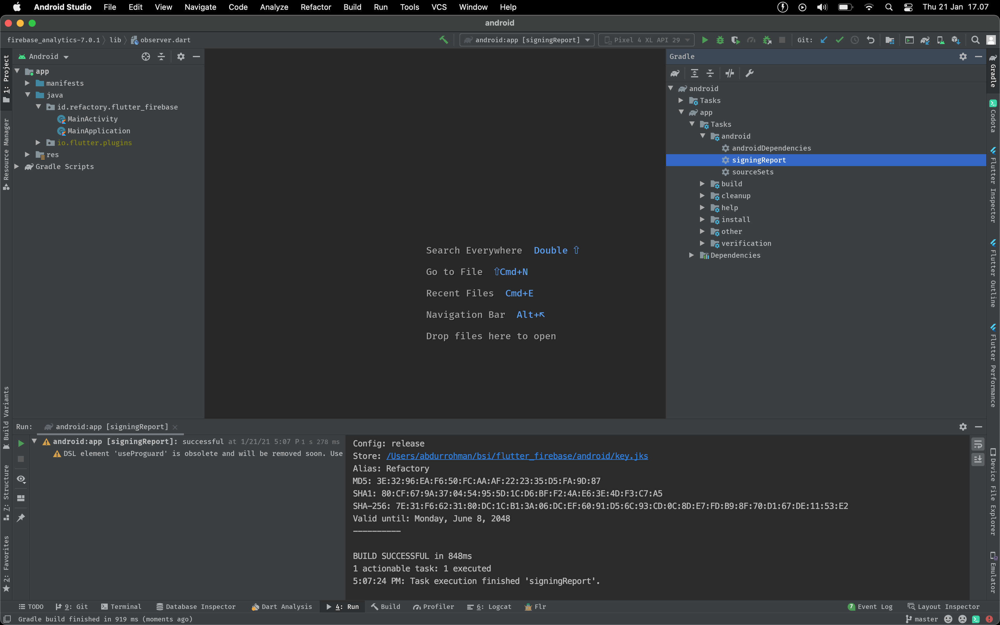
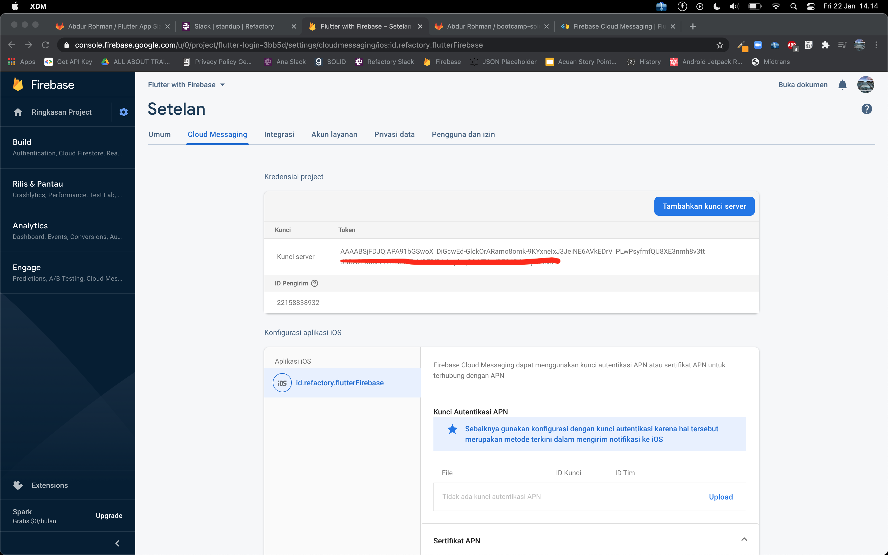
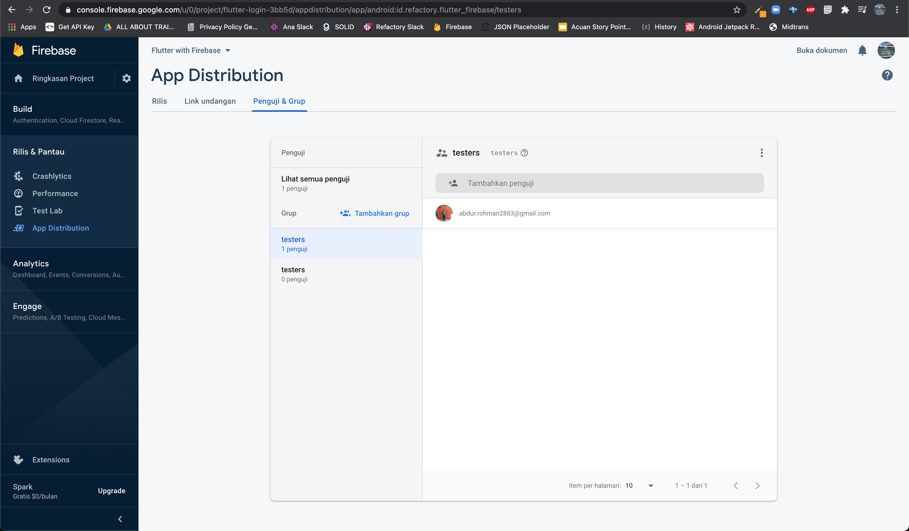
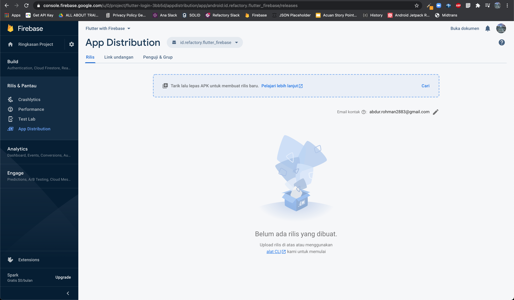

# Flutter Firebase

Firebase merupakan salah satu layanan dari Google yang memudahkan para app developer dalam mengembangkan aplikasi dan memonitoring aplikasi. Firebase memiliki banyak layanan dimulai dari Google Analytics, Cloud Messaging, Crashlytics, Performance Monitoring, Realtime Database, Cloud Storage, Hosting, Cloud Firestore.

## Firebase Product

Beberapa product dari Firebase yang dapat digunakan, diantaranya:

- Authentication (Android, iOS, Web, C++ dan Unity)
- Cloud Firestore (Android, iOS dan Web)
- Cloud Messaging (Android, iOS, Web, C++ dan Unity)
- App Distribution (Android dan iOS)

## Setup Firebase in Flutter

Setup project Flutter dapat mengikuti dari dokumentasi dari [FlutterFire](https://firebase.flutter.dev/docs/overview), namun FlutterFire masih dalam tahap work in progress artinya masih dalam pengerjaan dan bisa saja ada beberapa setup yang belum bisa dipakai dan beberapa dokumentasi mungkin belum lengkap (hanya sebagian kecil).

### **Create a Firebase Project**

- Silahkan menuju ke halaman [firebase console](https://console.firebase.google.com/), kemudian tambahkan project dan isikan nama Proyek yang akan digunakan.
  - Jika sudah memiliki project di [Google Cloud Platform (GCP)](https://console.cloud.google.com/), maka dapat memilih project tersebut dari menu drop-down untuk menambahkan resource Firebase ke project tersebut.
- Secara optional jika membuat project baru, maka di lain waktu dapat mengubah id project.
- Klik tombol lanjutkan.

**Android**

- Klik pada tombol ikon android untuk membuka alur setup firebase pada Android.
- Isikan nama paket Android yang ada di AndroidManifest.xml
- Secara optional isikan nama aplikasi Android.
- Secara optional isikan Sertifikat penandatanganan debug SHA-1 yang di dapatkan dengan cara berikut ini: 
- Klik tombol berikutnya
- Download file **google-service.json**, lalu tempatkan pada folder **android/app/google-service.json**.
- Klik tombol berikutnya
- Pada build.gradle project **android/build.gradle** tambahkan classpath google-service, atau lebih jelasnya bisa lihat dibawah ini:
  ```Groovy
  buildscript {
      ext.kotlin_version = '1.3.50'
      repositories {
          google()
          jcenter()
      }

      dependencies {
          classpath 'com.android.tools.build:gradle:3.5.4'
          classpath "org.jetbrains.kotlin:kotlin-gradle-plugin:$kotlin_version"
          classpath 'com.google.gms:google-services:4.3.4'
      }
  }

  allprojects {
      repositories {
          google()
          jcenter()
      }
  }

  rootProject.buildDir = '../build'
  subprojects {
      project.buildDir = "${rootProject.buildDir}/${project.name}"
  }
  subprojects {
      project.evaluationDependsOn(':app')
  }

  task clean(type: Delete) {
      delete rootProject.buildDir
  }
  ```
- Kemudian berpindah pada build.gradle app **android/app/build.gradle** tambahkan plugin google-service dan beberapa dependencies dari firebase, atau lebih jelasnya bisa lihat dibawah ini:
  ```Groovy
  def localProperties = new Properties()
  def localPropertiesFile = rootProject.file('local.properties')
  if (localPropertiesFile.exists()) {
      localPropertiesFile.withReader('UTF-8') { reader ->
          localProperties.load(reader)
      }
  }

  def flutterRoot = localProperties.getProperty('flutter.sdk')
  if (flutterRoot == null) {
      throw new GradleException("Flutter SDK not found. Define location with flutter.sdk in the local.properties file.")
  }

  def flutterVersionCode = localProperties.getProperty('flutter.versionCode')
  if (flutterVersionCode == null) {
      flutterVersionCode = '1'
  }

  def flutterVersionName = localProperties.getProperty('flutter.versionName')
  if (flutterVersionName == null) {
      flutterVersionName = '1.0'
  }

  def keystoreProperties = new Properties()
  def keystorePropertiesFile = rootProject.file('key.properties')
  if (keystorePropertiesFile.exists()) {
      keystoreProperties.load(new FileInputStream(keystorePropertiesFile))
  }

  apply plugin: 'com.android.application'
  apply plugin: 'kotlin-android'
  apply from: "$flutterRoot/packages/flutter_tools/gradle/flutter.gradle"
  apply plugin: 'com.google.gms.google-services'

  android {
      compileSdkVersion 30

      sourceSets {
          main.java.srcDirs += 'src/main/kotlin'
      }

      lintOptions {
          disable 'InvalidPackage'
      }

      defaultConfig {
          applicationId "id.refactory.flutter_firebase"
          minSdkVersion 16
          targetSdkVersion 30
          versionCode flutterVersionCode.toInteger()
          versionName flutterVersionName
      }

      signingConfigs {
          release {
              keyAlias keystoreProperties['keyAlias']
              keyPassword keystoreProperties['keyPassword']
              storeFile keystoreProperties['storeFile'] ? file(keystoreProperties['storeFile']) : null
              storePassword keystoreProperties['storePassword']
          }
      }

      buildTypes {
          release {
              shrinkResources true
              minifyEnabled true
              useProguard true
              proguardFiles getDefaultProguardFile('proguard-android.txt'), 'proguard-rules.pro'
              signingConfig signingConfigs.release
          }
      }
  }

  rootProject.ext {
      set('FlutterFire', [
              FirebaseSDKVersion: '26.3.0'
      ])
  }

  flutter {
      source '../..'
  }

  dependencies {
      implementation "org.jetbrains.kotlin:kotlin-stdlib-jdk7:$kotlin_version"
      implementation platform('com.google.firebase:firebase-bom:26.3.0')

      implementation 'com.google.firebase:firebase-analytics-ktx'
      implementation 'com.google.firebase:firebase-messaging-ktx'
      implementation 'com.google.firebase:firebase-core'
  }
  ```

- Tambahkan package firebase_core pada pubspec.yaml.
  ```yaml
  dependencies:
  flutter:
    sdk: flutter
  cupertino_icons:
  firebase_core:
  ```
- Download package yang ditambahkan atau dengan perintah **flutter pub get**.

## Firebase Authentication

Sebagian besar aplikasi perlu mengetahui identitas dari user. Mengetahui identitas pengguna memungkinkan aplikasi menyimpan data pengguna dengan aman di cloud dan memberikan pengalaman pribadi yang sama di semua perangkat user.
Firebase Authentication menyediakan layanan backend, SDK yang mudah digunakan, dan library UI yang siap pakai untuk mengautentikasi pengguna ke aplikasi Android. Firebase Authentication mendukung otentikasi menggunakan kata sandi, nomor telepon dan sosial media seperti Google, Facebook dan Twitter, dan banyak lagi.

### Installation

- Tambahkan package firebase_auth pada file pubspec.yaml:
  ```yaml
  dependencies:
  flutter:
    sdk: flutter
  cupertino_icons:
  firebase_core:
  firebase_auth:
  ```
- Download package yang ditambahkan atau dengan perintah **flutter pub get**.

### **Authenticate with Firebase using Password-Based Accounts on Android**

Firebase dapat melakukan authentikasi menggunakan email dan password untuk memanage account dan ini merupakan cara yang paling mudah dalam melakukan authentikasi di dalam Firebase Authentication.

**Registration**

Untuk membuat akun baru pada Firebase Authentication panggil method **createUserWithEmailAndPassword()** yang menerima argument email dan password.

```dart
try {
  UserCredential userCredential = await FirebaseAuth.instance.createUserWithEmailAndPassword(
    email: "barry.allen@example.com",
    password: "SuperSecretPassword!"
  );
} on FirebaseAuthException catch (e) {
  if (e.code == 'weak-password') {
    print('The password provided is too weak.');
  } else if (e.code == 'email-already-in-use') {
    print('The account already exists for that email.');
  }
} catch (e) {
  print(e);
}
```

**Login**

Untuk masuk ke dalam Firebase Authentication panggil method **signInWithEmailAndPassword()** yang menerima argument email dan password.

```dart
try {
  UserCredential userCredential = await FirebaseAuth.instance.signInWithEmailAndPassword(
    email: "barry.allen@example.com",
    password: "SuperSecretPassword!"
  );
} on FirebaseAuthException catch (e) {
  if (e.code == 'user-not-found') {
    print('No user found for that email.');
  } else if (e.code == 'wrong-password') {
    print('Wrong password provided for that user.');
  }
}
```

**Logout**

Untuk keluar dari Firebase Authentication panggil method **signOut()** tanpa menerima argument apapun yang merupakan sebuah __Future__.

```dart
await FirebaseAuth.instance.signOut();
```

## Cloud Firestore

Cloud Firestore adalah database yang flexible dan scalable untuk pengembangan mobile, web, dan server dari Firebase dan Google Cloud Platform. Seperti halnya dengan Firebase Realtime Database, Firestore menjaga data tetap sinkron di seluruh aplikasi klien melalui realtime listeners dan menawarkan fitur offline untuk mobile dan web sehingga dapat membangun aplikasi responsif yang berfungsi baik terlepas dari latensi jaringan atau konektivitas internet.

### **Installation**

- Tambahkan package cloud_firestore pada file pubspec.yaml:
  ```yaml
  dependencies:
  flutter:
    sdk: flutter
  cupertino_icons:
  firebase_core:
  firebase_auth:
  cloud_firestore:
  ```
- Download package yang ditambahkan atau dengan perintah **flutter pub get**.

### **Collections & Documents**

Cloud Firestore menyimpan data kedalam document, yang di mana document berada di dalam collection. Collection bisa diartikan sebagai database dan document merupakan sebuah table akan tetapi document dapat memiliki document lain di dalamnya atau biasa disebut nested document.

### **Create Data**

Sebagai contoh di sini ada sebuah database / collection dengan nama **users**, kode dibawah ini adalah contoh untuk memanbahkan user baru ketika tombol ditekan:

```dart
import 'package:flutter/material.dart';

// Import the firebase_core and cloud_firestore plugin
import 'package:firebase_core/firebase_core.dart';
import 'package:cloud_firestore/cloud_firestore.dart';

class AddUser extends StatelessWidget {
  final String fullName;
  final String company;
  final int age;

  AddUser(this.fullName, this.company, this.age);

  @override
  Widget build(BuildContext context) {
    // Create a CollectionReference called users that references the firestore collection
    CollectionReference users = FirebaseFirestore.instance.collection('users');

    Future<void> addUser() {
      // Call the user's CollectionReference to add a new user
      return users
          .add({
            'full_name': fullName, // John Doe
            'company': company, // Stokes and Sons
            'age': age // 42
          })
          .then((value) => print("User Added"))
          .catchError((error) => print("Failed to add user: $error"));
    }

    return TextButton(
      onPressed: addUser,
      child: Text(
        "Add User",
      ),
    );
  }
}
```

Method __add()__ diatas akan membuat document baru dengan unique id yang tergenerate tersendiri, jika ingin memakai unique id sendiri dapat menggunakan method __set()__.

```dart
CollectionReference users = FirebaseFirestore.instance.collection('users');

Future<void> addUser() {
  return users
    .doc('ABC123')
    .set({
      'full_name': "Mary Jane",
      'age': 18
    })
    .then((value) => print("User Added"))
    .catchError((error) => print("Failed to add user: $error"));
}
```

### **One Time Read Data**

Cloud Firestore mempunyai kemampuan untuk membaca value dari collection atau document, pembacaan value dapat dilakukan dengan sekali pembacaan. Pembacaan value dari document dapat menggunakan method **DocumentReference.get()**, lebih jelasnya lihat kode dibawah ini:

```dart
class GetUserName extends StatelessWidget {
  final String documentId;

  GetUserName(this.documentId);

  @override
  Widget build(BuildContext context) {
    CollectionReference users = FirebaseFirestore.instance.collection('users');

    return FutureBuilder<DocumentSnapshot>(
      future: users.doc(documentId).get(),
      builder:
          (BuildContext context, AsyncSnapshot<DocumentSnapshot> snapshot) {

        if (snapshot.hasError) {
          return Text("Something went wrong");
        }

        if (snapshot.connectionState == ConnectionState.done) {
          Map<String, dynamic> data = snapshot.data.data();
          return Text("Full Name: ${data['full_name']} ${data['last_name']}");
        }

        return Text("loading");
      },
    );
  }
}
```

### **Real Time Changes**

Cloud Firestore menyediakan fitur realtime database untuk collection maupun document. Setiap ada perubahan pada collection atau documen, seperti: tambah data, update data maupun hapus data maka Cloud Firestore akan memanggil perubahan data pada aplikasi flutter.

Realtime database pada Cloud Firestore dapat dilakukan dengan membuat __Stream__ pada CollectionReference atau DocumentReference yang menyediakan method **snapshots** yang mengembalikan value __Stream__.

```dart
Stream collectionStream = FirebaseFirestore.instance.collection('users').snapshots();
Stream documentStream = FirebaseFirestore.instance.collection('users').doc('ABC123').snapshots();
```

Value stream dapat dikombinasikan dengan widget **StreamBuilder()** yang secara otomatis akan mengatur Stream state dan akan menghapus Stream ketika tidak digunakan pada aplikasi.

```dart
class UserInformation extends StatelessWidget {
  @override
  Widget build(BuildContext context) {
    CollectionReference users = FirebaseFirestore.instance.collection('users');

    return StreamBuilder<QuerySnapshot>(
      stream: users.snapshots(includeMetadataChanges: true),
      builder: (BuildContext context, AsyncSnapshot<QuerySnapshot> snapshot) {
        if (snapshot.hasError) {
          return Text('Something went wrong');
        }

        if (snapshot.connectionState == ConnectionState.waiting) {
          return Text("Loading");
        }

        return ListView(
          children: snapshot.data.documents.map((DocumentSnapshot document) {
            return ListTile(
              title: Text(document.data()['full_name']),
              subtitle: Text(document.data()['company']),
            );
          }).toList(),
        );
      },
    );
  }
}
```

### __QuerySnapshot__

QuerySnapshot merupakan pengembalian dari query pada collection, seperti: berapa jumlah document pada collection tersebut, mengakses document berdasarkan QuerySnapshot yang dikembalikan, dsb.

Document dapat diakses melalui QuerySnapshot dengan memanggil properti __docs__ yang mempunyai value `List<DocumentSnapshot>`.

```dart
FirebaseFirestore.instance
    .collection('users')
    .get()
    .then((QuerySnapshot querySnapshot) => {
        querySnapshot.docs.forEach((doc) {
            print(doc["first_name"]);
        });
    });
```

### __DocumentSnapshot__

DocumentSnapshot merupakan pengembalian dari query atau akses ke document secara langsung, baik document tersebut ada atau tidak.

Document ada di dalam collection atau tidak dapat diketahui dengan menggunakan properti __exists__, jika document ada di dalam collection maka document dapat memanggil method __data()__ yang mengembalikan nilai __Map<String, dynamic>__ dan jika document tidak ada maka akan mengembalikan nilai __null__.

```dart
FirebaseFirestore.instance
    .collection('users')
    .doc(userId)
    .get()
    .then((DocumentSnapshot documentSnapshot) {
      if (documentSnapshot.exists) {
        print('Document data: ${documentSnapshot.data()}');
      } else {
        print('Document does not exist on the database');
      }
    });
```

### __Querying__

Cloud Firestore menawarkan kemampuan yang advance untuk membuat query pada collection, query dapat berjalan pada one time read atau bahkan di realtime changes.

```dart
// Filtering
FirebaseFirestore.instance
  .collection('users')
  .where('age', isGreaterThan: 20)
  .get()
  .then(...);

FirebaseFirestore.instance
  .collection('users')
  .where('language', arrayContainsAny: ['en', 'it'])
  .get()
  .then(...);

// Limiting
FirebaseFirestore.instance
  .collection('users')
  .limit(2)
  .get()
  .then(...);

FirebaseFirestore.instance
  .collection('users')
  .orderBy('age')
  .limitToLast(2)
  .get()
  .then(...);

// Ordering
FirebaseFirestore.instance
  .collection('users')
  .orderBy('age', descending: true)
  .get()
  .then(...);
```

### __Updating documents__

Cloud Firestore menyediakan kemampuan untuk melakukan perubahan data pada document. Method __set()__ sebenarnya bisa digunakan untuk mengubah data namun secara keseluruhan atau mereplace data yang sudah ada, sedangkan method __update()__ hanya mengubah data berdasarkan fieldnya saja.

```dart
CollectionReference users = FirebaseFirestore.instance.collection('users');

Future<void> updateUser() {
  return users
    .doc('ABC123')
    .update({'company': 'Stokes and Sons'})
    .then((value) => print("User Updated"))
    .catchError((error) => print("Failed to update user: $error"));
}

CollectionReference users = FirebaseFirestore.instance.collection('users');

// Update on nested document
Future<void> updateUser() {
  return users
    .doc('ABC123')
    .update({'info.address.zipcode': 90210})
    .then((value) => print("User Updated"))
    .catchError((error) => print("Failed to update user: $error"));
}
```

### __Updating Field Values__

Cloud Firestore memiliki kemampuan untuk menyimpan dan memanipulasi nilai pada document, seperti Timestamps, GeoPoints, Blobs dan Array.

```dart
// GeoPoint value
CollectionReference users = FirebaseFirestore.instance.collection('users');

Future<void> updateUser() {
  return users
    .doc('ABC123')
    .update({'info.address.location': GeoPoint(53.483959, -2.244644)})
    .then((value) => print("User Updated"))
    .catchError((error) => print("Failed to update user: $error"));
}

// Blob value
CollectionReference users = FirebaseFirestore.instance.collection('users');

Future<void> updateUser() {
  return rootBundle
    .load('assets/images/sample.jpg')
    .then((bytes) => bytes.buffer.asUint8List())
    .then((avatar) {
      return users
        .doc('ABC123')
        .update({'info.avatar': Blob(avatar)});
      })
    .then((value) => print("User Updated"))
    .catchError((error) => print("Failed to update user: $error"));
}
```

### __Removing Data__

Cloud Firestore menyediakan fitur untuk menghapus document dengan method __delete()__ pada DocumentReference.

```dart
CollectionReference users = FirebaseFirestore.instance.collection('users');

Future<void> deleteUser() {
  return users
    .doc('ABC123')
    .delete()
    .then((value) => print("User Deleted"))
    .catchError((error) => print("Failed to delete user: $error"));
}
```

Cloud Firestore juga menyediakan fitur untuk menghapus field pada document.

```dart
CollectionReference users = FirebaseFirestore.instance.collection('users');

Future<void> deleteField() {
  return users
    .doc('ABC123')
    .update({'age': FieldValue.delete()})
    .then((value) => print("User Deleted"))
    .catchError((error) => print("Failed to delete user: $error"));
}
```

### __Transaction__

Transaksi adalah cara untuk memastikan bahwa operasi write hanya terjadi menggunakan data terbaru yang tersedia di server. Transaksi tidak pernah menerapkan penulisan data secara parsial, dan penulisan data dijalankan pada akhir transaksi yang berhasil.

Transaksi berguna saat ingin memperbarui field berdasarkan nilainya saat ini, atau nilai field yang lain. Jika ingin memanipulasi banyak dokumen tanpa menggunakan dokumen status saat ini, maka write batch harus digunakan.

Saat menggunakan transaction, pastikan bahwa:

- Operasi read harus dilakukan sebelum operasi write.
- Transaction akan gagal ketika klien sedang offline dan tidak dapat menggunakan data cache.

Untuk menggunakan transaction, panggil method __runTransaction()__.

```dart
// Create a reference to the document the transaction will use
DocumentReference documentReference = FirebaseFirestore.instance
  .collection('users')
  .doc(documentId);

return Firestore.instance.runTransaction((transaction) async {
  // Get the document
  DocumentSnapshot snapshot = await transaction.get(documentReference);

  if (!snapshot.exists) {
    throw Exception("User does not exist!");
  }

  // Update the follower count based on the current count
  // Note: this could be done without a transaction
  // by updating the population using FieldValue.increment()

  int newFollowerCount = snapshot.data()['followers'] + 1;

  // Perform an update on the document
  transaction.update(documentReference, {'followers': newFollowerCount});

  // Return the new count
  return newFollowerCount;
})
.then((value) => print("Follower count updated to $value"))
.catchError((error) => print("Failed to update user followers: $error"));
```

### __Batch Write__

Firestore memungkinkan untuk menjalankan beberapa operasi write sebagai satu batch yang dapat berisi kombinasi operasi set, update, atau delete.

Pertama, buat instance batch baru melalui method __batch()__, lakukan operasi pada batch setelah siap. Contoh di bawah ini menunjukkan cara menghapus semua dokumen dalam koleksi dalam satu operasi:

```dart
CollectionReference users = FirebaseFirestore.instance.collection('users');

Future<void> batchDelete() {
  WriteBatch batch = FirebaseFirestore.instance.batch();

  return users.get().then((querySnapshot) {
    querySnapshot.documents.forEach((document) {
      batch.delete(document.reference);
    });

    return batch.commit();
  });
}
```

## Firebase Cloud Messaging

Firebase Cloud Messaging (FCM) adalah solusi messaging cross platform yang memungkinkan untuk mengirim pesan dengan handal tanpa memungut biaya.
Dengan menggunakan FCM, aplikas dapat memberitahu client bahwa ada notifikasi masuk ke client dengan membawa data untuk disinkronkan. Untuk kasus penggunaan seperti instant messaging, sebuah pesan dapat mentransfer payload hingga 4 KB ke client.

### **Installation**

- Tambahkan package cloud_firestore pada file pubspec.yaml:
  ```yaml
  dependencies:
  flutter:
    sdk: flutter
  cupertino_icons:
  firebase_core:
  firebase_auth:
  cloud_firestore:
  firebase_messaging:
  flutter_local_notifications:
  ```
- Download package yang ditambahkan atau dengan perintah **flutter pub get**.

### __Android Integration__

Untuk menjalankan push notification di Android, pertama yang dilakukan adalah menyediakan callback untuk mendaftarkan plugin untuk menjalanlan push notification service. Ini dilakukan dengan memberikan callback pada __FlutterFirebaseMessagingBackgroundService__ yang dipanggil di method onCreate aplikasi dan activity.

__MainApplication.kt__
```Kotlin
class MainApplication : FlutterApplication(), PluginRegistry.PluginRegistrantCallback {
    override fun onCreate() {
        super.onCreate()
        FlutterFirebaseMessagingService.setPluginRegistrant(this)
        FlutterMain.startInitialization(this)
    }

    override fun registerWith(registry: PluginRegistry?) {
        FirebaseMessagingPlugin.registerWith(registry?.registrarFor("io.flutter.plugins.firebasemessaging.FirebaseMessagingPlugin"))
        FlutterLocalNotificationsPlugin.registerWith(registry?.registrarFor("com.dexterous.flutterlocalnotifications.FlutterLocalNotificationsPlugin"))
    }
}
```

__MainActivity.kt__

```Kotlin
class MainActivity: FlutterActivity(), PluginRegistry.PluginRegistrantCallback {
    override fun onCreate(savedInstanceState: Bundle?) {
        super.onCreate(savedInstanceState)
        FlutterFirebaseMessagingService.setPluginRegistrant(this)
        FlutterMain.startInitialization(this)
    }

    override fun registerWith(registry: PluginRegistry?) {
        if (registry?.hasPlugin("io.flutter.plugins.firebasemessaging") == false) {
            FirebaseMessagingPlugin.registerWith(registry.registrarFor("io.flutter.plugins.firebasemessaging.FirebaseMessagingPlugin"))
        }
        if (registry?.hasPlugin("com.dexterous.flutterlocalnotifications") == false) {
            FlutterLocalNotificationsPlugin.registerWith(registry.registrarFor("com.dexterous.flutterlocalnotifications.FlutterLocalNotificationsPlugin"))
        }
    }
}
```

Pastikan pada file AndroidManifest.xml memakai MainApplication yang sudah dibuat tadi.

```xml
<manifest xmlns:android="http://schemas.android.com/apk/res/android" package="id.refactory.flutter_firebase">
  <application android:name=".MainApplication" android:label="flutter_firebase" android:icon="@mipmap/ic_launcher">
    <activity android:name=".MainActivity" android:launchMode="singleTop" android:theme="@style/LaunchTheme" android:configChanges="orientation|keyboardHidden|keyboard|screenSize|smallestScreenSize|locale|layoutDirection|fontScale|screenLayout|density|uiMode" android:hardwareAccelerated="true" android:windowSoftInputMode="adjustResize" android:showWhenLocked="true" android:turnScreenOn="true">
      <meta-data android:name="io.flutter.embedding.android.NormalTheme" android:resource="@style/NormalTheme" />
      <meta-data android:name="io.flutter.embedding.android.SplashScreenDrawable" android:resource="@drawable/launch_background" />
      <intent-filter>
        <action android:name="android.intent.action.MAIN"/>
        <category android:name="android.intent.category.LAUNCHER"/>
      </intent-filter>
      <intent-filter>
        <action android:name="FLUTTER_NOTIFICATION_CLICK" />
        <category android:name="android.intent.category.DEFAULT" />
      </intent-filter>
    </activity>
    <meta-data android:name="com.google.firebase.messaging.default_notification_channel_id" android:value="high_importance_channel" />
    <meta-data android:name="flutterEmbedding" android:value="2" />
  </application>
</manifest>
```

### __Create Notification Handles__

Pertama buat sebuah konfigurasi yang sudah tersedia di file __lib/main.dart__.

```dart
void main() async {
  WidgetsFlutterBinding.ensureInitialized();
  await Firebase.initializeApp();

  final auth = FirebaseAuth.instance;
  final reference = FirebaseFirestore.instance.collection("users");
  final fcmKey =
      "AAAABSjFDJQ:APA91bGSwoX_DiGcwEd-GlckOrARamo8omk-9KYxneIxJ3JeiNE6AVkEDrV_PLwPsyfmfQU8XE3nmh8v3ttJBBA2Ek0enzt9iTNem7aVOFBlP6rbvyfaqG0rVTJoJRFC6B4mzjbO9M79";
  final dio = Dio();

  dio.options.connectTimeout = 60 * 1000;
  dio.options.receiveTimeout = 60 * 1000;
  dio.options.sendTimeout = 60 * 1000;
  dio.options.baseUrl = "https://fcm.googleapis.com/";
  dio.options.headers = {
    "Content-Type": "application/json",
    "Authorization": "key=$fcmKey"
  };

  if (MyApp.isDebug) {
    dio.interceptors.add(LogInterceptor(
      requestBody: true,
      responseBody: true,
      requestHeader: true,
      responseHeader: true,
      request: true,
      error: true,
    ));
  }
  final firebaseMessaging = FirebaseMessaging();

  runApp(MultiProvider(
    providers: [
      ChangeNotifierProvider(
          create: (context) => AuthProvider(auth, reference)),
      ChangeNotifierProvider(
          create: (context) =>
              HomeProvider(firebaseMessaging, auth, reference, dio)),
    ],
    child: MyApp(),
  ));
}

class MyApp extends StatelessWidget {
  static bool get isDebug {
    bool inDebugMode = false;
    assert(inDebugMode = true);
    return inDebugMode;
  }

  static AndroidNotificationChannel get _channel => AndroidNotificationChannel(
        'high_importance_channel', // id
        'High Importance Notifications', // title
        'This channel is used for important notifications.', // description
        importance: Importance.max,
      );

  static Future<dynamic> handleMessage(Map<String, dynamic> payload) async {
    print("${Platform.isIOS ? 'iOS' : 'Android'}: $payload");

    if (payload.containsKey("data")) {
      final data = payload["data"];
      final sender = data["sender"];
      final message = data["message"];

      FlutterLocalNotificationsPlugin().show(
          message.hashCode,
          "Pesan masuk dari $sender",
          message,
          NotificationDetails(
            android: AndroidNotificationDetails(
              _channel.id,
              _channel.name,
              _channel.description,
            ),
          ),
          payload: message);
    }
  }

  @override
  Widget build(BuildContext context) {
    return FutureBuilder(
        future: Future.delayed(Duration(seconds: 1), () async {
          final flutterLocalNotificationsPlugin =
              FlutterLocalNotificationsPlugin();
          final initializationSettingsAndroid =
              AndroidInitializationSettings('@mipmap/ic_launcher');
          final IOSInitializationSettings initializationSettingsIOS =
              IOSInitializationSettings(
            onDidReceiveLocalNotification: (id, title, body, payload) async {},
          );
          final MacOSInitializationSettings initializationSettingsMacOS =
              MacOSInitializationSettings();
          final InitializationSettings initializationSettings =
              InitializationSettings(
                  android: initializationSettingsAndroid,
                  iOS: initializationSettingsIOS,
                  macOS: initializationSettingsMacOS);

          flutterLocalNotificationsPlugin.initialize(
            initializationSettings,
            onSelectNotification: (payload) async {
              print(payload);
            },
          );

          await flutterLocalNotificationsPlugin
              .resolvePlatformSpecificImplementation<
                  AndroidFlutterLocalNotificationsPlugin>()
              ?.createNotificationChannel(_channel);

          FirebaseMessaging().configure(
              onMessage: handleMessage,
              onBackgroundMessage: Platform.isAndroid ? handleMessage : null,
              onResume: handleMessage,
              onLaunch: handleMessage);
        }),
        builder: (context, snapshot) {
          if (snapshot.hasError) {
            return OopsWidget();
          }

          if (snapshot.connectionState == ConnectionState.done) {
            return MaterialApp(
              title: 'Flutter Demo',
              theme: ThemeData(
                primarySwatch: Colors.blueGrey,
                scaffoldBackgroundColor: colorPrimary,
                visualDensity: VisualDensity.adaptivePlatformDensity,
              ),
              home: LoginPage(),
              routes: {
                RegisterPage.route: (_) => RegisterPage(),
                HomePage.route: (_) => HomePage(),
              },
            );
          }

          return LogoWidget();
        });
  }
}
```

Perhatikan pada instance dio sudah terdapat base url untuk melakukan push notification dari REST API dan fcmKey yang didapatkan pada fiebase console.



Sekarang fokus pada class __MyApp__, disitu sudah ada sebuah initialisasi setup Notifikasi Android termasuk untuk handle push notification dalam kondisi aplikasi berada di background (aplikasi sudah ditutup oleh user).

Untuk mengirimkan push notifikasi ke target, pertama harus mendapatkan token terlebih dahulu dengan method __getToken()__ dari FirebaseMessaging. Secara detail bisa lihat di class __HomePage__ dan __HomeProvider__.

```dart
void getToken() {
  _firebaseMessaging.getToken().then((token) =>
      _reference.doc(_auth.currentUser.uid).update({"token": token}));
}
```

Setelah mendapatakan token dari FirebaseMessaging, selanjutnya membuat method yang akan mengirimkan data ke REST API ke base url yang sudah dibuat di Dio.

```dart
await _dio.post("fcm/send", data: {
  "data": {
    "click_action": "FLUTTER_NOTIFICATION_CLICK",
    "sender": _auth.currentUser.email,
    "image": _auth.currentUser.photoURL,
    "message": message
  },
  "to": user.token
});
```

Untuk menampilkan pesan notifikasi di Android, perhatikan pada method __show()__ dari class FlutterLocalNotificationsPlugin yang menerima argument title, body dan norification details.

```dart
final data = payload["data"];
final sender = data["sender"];
final message = data["message"];

FlutterLocalNotificationsPlugin().show(
    message.hashCode,
    "Pesan masuk dari $sender",
    message,
    NotificationDetails(
      android: AndroidNotificationDetails(
        _channel.id,
        _channel.name,
        _channel.description,
      ),
    ),
    payload: message);
```

Berikut ini adalah hasil dari implementasi dari Push Notification di Flutter menggunakan Firebase Cloud Messaging dan Flutter Local Notification.


## App Distribution

Firebase App Distribution memudahkan pendistribusian aplikasi ke tester tepercaya atau team QA dari perusahaan. Aplikasi yang sudah dibuild dapat didistribusikan melalui Firebase App Distribution yang dapat diberikan kepada tester atau QA melalui aplikasi App Distribution dari Firebase, aplikasi yang sudah didistribusikan melalui Firebase App Distribution dapat segera diinstal oleh tester atau QA secara cepat dan tidak perlu melalui Google Play Store maupun Apple Store. 

Dengan memasukkan aplikasi ke device tester atau QA secara cepat, maka aplikasi akan mendapatkan masukan lebih awal dan sering yang kemudian dapat segera dilakukan perbaikan bilaman ditemukan sebuah kesalahan dari aplikasi yang sudah dibuild.

### __Create Tester Group__

Sebelum melakukan distribusi aplikasi, langkah yang bagus adalah membuat group yang berisikan tester yang terpercaya dan team QA dari perusahaan. Berikut ini adalah gambar untuk membuat tester group pada Firebase App Distribution:



### __Distribute the App__

Untuk melakukan distribusi aplikasi pastikan bahwa aplikasi sudah dibuild dalam bentuk __.apk__ untuk android dan __.ipa__ untuk ios, kemudian drag atau cari aplikasi yang akan didistribusikan. Lebih jelasnya bisa lihat pada gambar dibawah ini untuk melakukan distribusi aplikasi.

