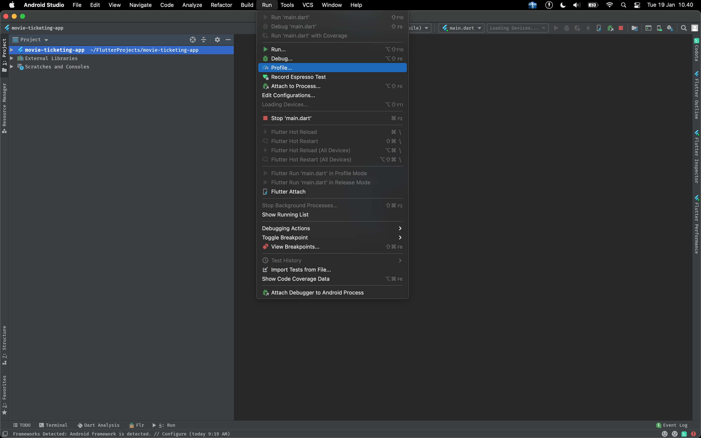
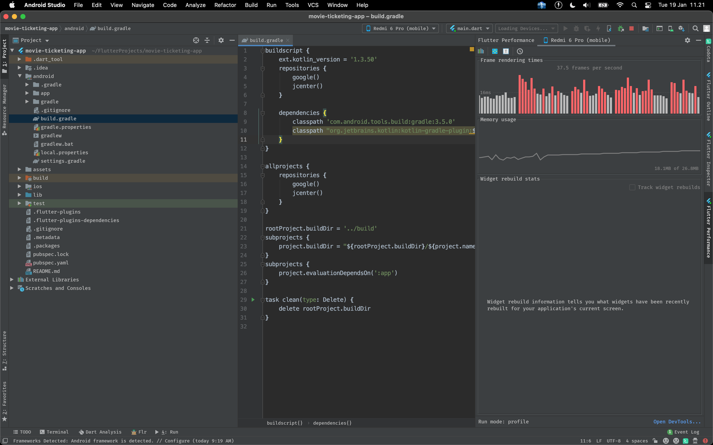
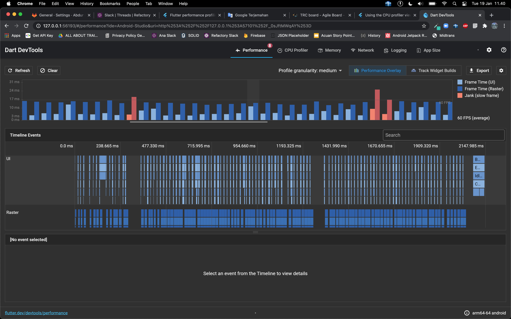

# Flutter Performance Profiling

Aplikasi yang bagus tidak hanya menawarkan design yang menarik saja, tetapi aplikasi harus juga memawarkan performa yang baik. Performa aplikasi dapat dilihat dari seberapa cepat proses render view, seberapa smooth UI yang ditampilkan, kecepatan dalam mengeksekusi perintah asynchronous seperti http request, read and write local storage atau database lokal, dsb.

Pembahasan ini akan lebih ditekankan pada performa dari segi UI seperti: seberapa cepat merender tampilan pada aplikasi dan seberapa smooth aplikasi ketika menampilkan UI. Flutter sendiri mendukung untuk performa 60 fps atau lebih seperti 120 fps untuk device yang mendukung 120 fps, semakin besar fps yang didukung maka aplikasi akan semakin lebih smooth dalam merender UI pada aplikasi.

## Diagnosing Performance Problems

Diagnosa permasalahan performa pada Flutter berarti akan mengecek pada cakupan UI thread dan Raster thread (GPU Thread) dengan tujuan aplikasi Flutter memiliki performa kurang lebih 60 fps atau dibawah 16 ms untuk render setiap framenya. 

Dalam mendiagnosa performa aplikasi Flutter dibutuhkan sebuah real device bukan emulator maupun simulator untuk menjalankan aplikasi dalam mode profiling, sebisa mungkin untuk memakai device yang low spesifikasi yang mungkin akan dipakai oleh user dengan harapan kalau device dengan low spesifikasi menjalankan performa aplikasi dengan baik, maka secara otomatis untuk device yang lebih tinggi spesifikasinya akan lebih baik lagi performanya. 

## Running Flutter App in Profile Mode

Profile mode dalam Flutter sebenarnya hampir sama dengan mode release, namun ada beberapa fungsionalitas tambahan yang memungkinkan untuk mendebug performa dari aplikasi Flutter. Profile mode menyediakan informasi yang dapat ditelusuri ke tools profiling. Dalam menjalankan mode profiling, lebih disarankan untuk menggunakan Android Studio karena lebih mudah dalam melakukan debug profiling pada aplikasi Flutter. Berikut ini adalah caranya:

1. Buka aplikasi Flutter di Android Studio.
2. Pada item menu Run pilih menu Profile, kemudian pilih main.dart. 
3. Buka tab flutter performance untuk melihat performa dari aplikasi Flutter seperti waktu yang dibutuhkan dalam merender UI, fps yang didapatkan dan memory yang dipakai. 
4. Buka DevTools untuk memakai fitur yang lebih banyak dari Profling dan Flutter Performance seperti: memory heap, battery consumtion, performance overlay, network, logging dan app size analyze. 

## Tips and Trick Improve Flutter Performance

Ada banyak cara untuk meningkatkan performa dari aplikasi Flutter, diantaranya:

1. Kurangi animasi untuk setiap widget atau component, karena dengan banyaknya animasi maka GPU perlu bekerja lebih keras yang akan mengakibatkan terjadinya fps drop dan animasi yang dihasilkan akan lag atau patah - patah.
2. Gunakanlah state management, perlu diketahui ketika aplikasi tidak memakai state management maka setiap ada perubahan state maka aplikasi akan mendaur ulang seluruh widget yang akan mengakibatkan fps drop. Berbeda halnya dengan memakai state management, setiap ada perubahan state maka widget / component yang memakai state tersebut saja yang akan didaur ulang oleh aplikasi sehingga akan memberikan load kerja yang lebih sedikit untuk GPU daripada tanpa menggunakan state management.
3. Perkecil ukuran resource, pastikan untuk selalu memakai resource yang kecil seperti menggunakan .svg untuk icon dan file png dan jpeg yang sudah dikompress dengan harapan GPU tidak perlu memproses load binary yang besar yang nantinya juga akan mengakibatkan fps drop.
4. Render data collection ke dalam bentuk list dan grid secara lazily, senantiasa menggunakan ListView.builder atau GridView.builder untuk menampilkan data collection secara lazily.
5. Usahakan untuk tidak membuat widget tree yang komplek, karena ini akan mempengaruhi proses render apalagi widget tersebut sering berubah - ubah statenya.