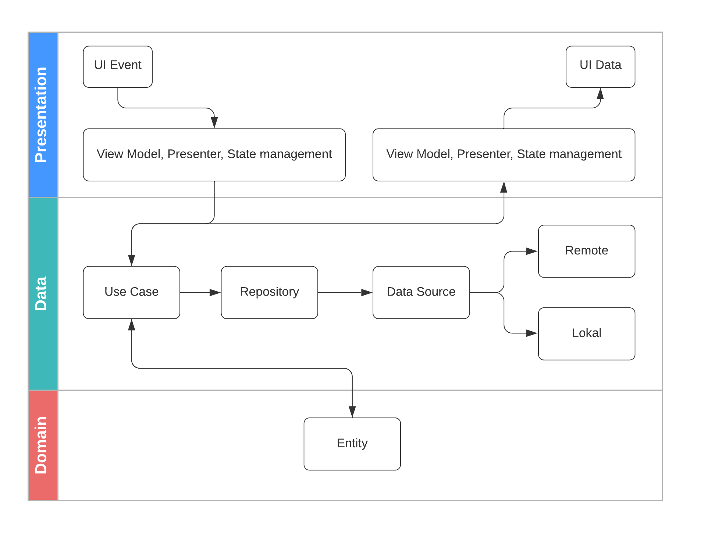

# Flutter Clean Architetcure

Clean architecture merupakan salah satu jenis dari architetcure software yang benar - benar menerapkan sifat single reponsibility (setiap class hanya mempunyai satu tanggung jawab), clean architetcure diperkenalkan oleh Robert Cecil Martin atau biasa dikenal sebagai [uncle Bob](https://en.wikipedia.org/wiki/Robert_C._Martin). Sebelum membahas lebih lanjut mengenai clean architecture alangkah baiknya mengenal software architetcure terlebih dahulu.

## Software Architecture

Software Architecture merupakan sebuah prinsip atau aturan dalam membangun aplikasi perangkat lunak yang telah disepakati bersama, Software Architecture menjadi peran penting dalam proses pengembangan software dan maintenance software dikarenakan setiap pengembangan aplikasi pasti tidak dikerjakan hanya satu orang, namun dikerjakan oleh tim. 

Salah satu kendala ketika tidak menggunakan Software Architecture adalah banyaknya cara atau flow dalam pengembangan software karena setiap orang memiliki Software Architecture tersendiri yang mengakibatkan flow yang tidak terstruktu dan kebanyakan akan susah dalam memaintenance karena tidak adanya persamaan prinsip dari masing - masing developer dalam mengembangkan aplikasi sofware.

## Clean Architure Concept

Konsep dari Clean Architecture sebenarnya mengacu pada gambar dibawah ini:

Dari gambar diatas dijelaskan bahwa dalam sebuah aplikasi sofware terdapat kurang lebih empat layer, yaitu: entities, use case, interface adapters dan framework atau ada juga yang mempersingkatnya menjadi tiga layer yaitu: domain, data dan presentation. Setiap layer memiliki ruang lingkupnya masing - masing, sebagai contoh pada domain hanya dalam lingkup raw data, bisa berupa model / entities yang merupakan bussiness model yang nantinya akan didriver pada aplikasi software.

### The Dependency Rule

Clean Architecture dapat berjalan dengan baik berkat adanya The Dependency Rule. Aturan ini menyatakan bahwa dependensi kode hanya bisa mengarah ke dalam dan tidak ada kode yang didlam mengetahui kode yang ada diluar layernya. Kode dari luar hanya boleh diketahui hanyalah kode yang bersifat abstrak saja, tidak berupa konkret. Hal ini akan membuat kode menjadi lebih fleksibel karena layer yang didalam tidak mengetahui kode dari kode yang diluar, sehingga pada kode yang diluar bebas melakukan apa saja selama menganut dari kontrak dari abstraksi yang telah dibuat.

### Layers

Seperti pembahasan sebelumnya sebenarnya ada beberapa vesi layer dari clean architecture salah satunya adalah dengan tiga layer, yaitu:

1. Domain: Domain mencakup aturan bisnis luas pada perusahaan. Domain dapat berupa objek dengan metode, atau dapat berupa sekumpulan struktur dan fungsi data. Tidak masalah asalkan domain dapat digunakan oleh banyak aplikasi yang berbeda di perusahaan. Domain ini juga dapat berupa objek bisnis dari aplikasi yang mencakup aturan yang paling umum dan tingkat tinggi. Domain paling kecil kemungkinannya untuk berubah ketika sesuatu dari luar berubah.

2. Data: Data mencakup aturan akses domain dari data source, data source bisa dari remote / server, bisa juga dari local maupun dari cloud (seperti Firebase). Data menyediakan bussiness logic untuk domain, bussiness logic bersifat use case tunggal seperti retrieveAllBooks dari domain.

3. Presentation: Presentation mencakup aturan dalam membuat UI pada aplikasi, interaksi user dengan UI berupa Event yang akan mentrigger untuk memanggil use case dan semua yang mencakup pada Framework seperti DI, Utils, ViewModel, State, Presenter dsb.

### Clean Architecture Flow

Gambar diatas merupakan alur dari Clean Architecture, berawal dari interaksi UI dengan User yang menghasilkan UI Event yang akan memanggil method dari State management, View Model dan Presenter. Didalam method tersebut akan memanggil salah satu use case pada layer data, kemudian akan menghasilkan data berupa domain melalui proses mapper dari reposiory yang memangil data dari lokal atau server. Domain akan diterima oleh use case yang nantinya akan ditahan di State management, Presenter atau View Model yang kemudian akan ditampilkan ke dalam UI.